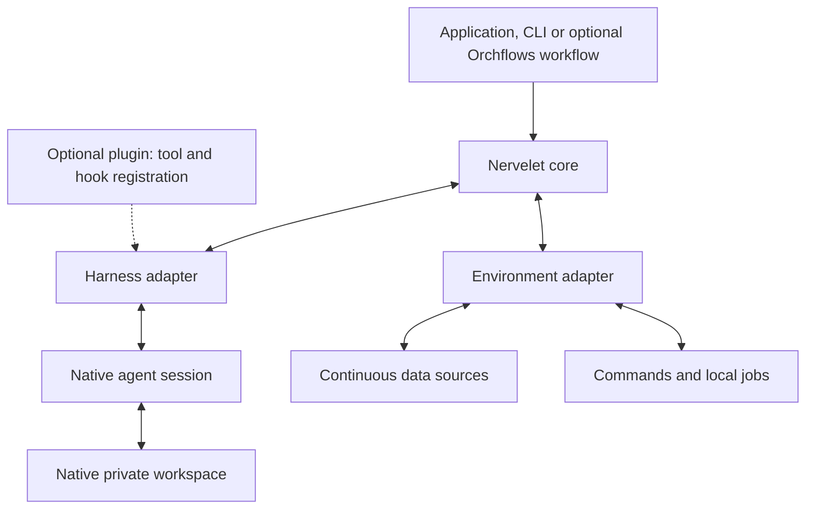
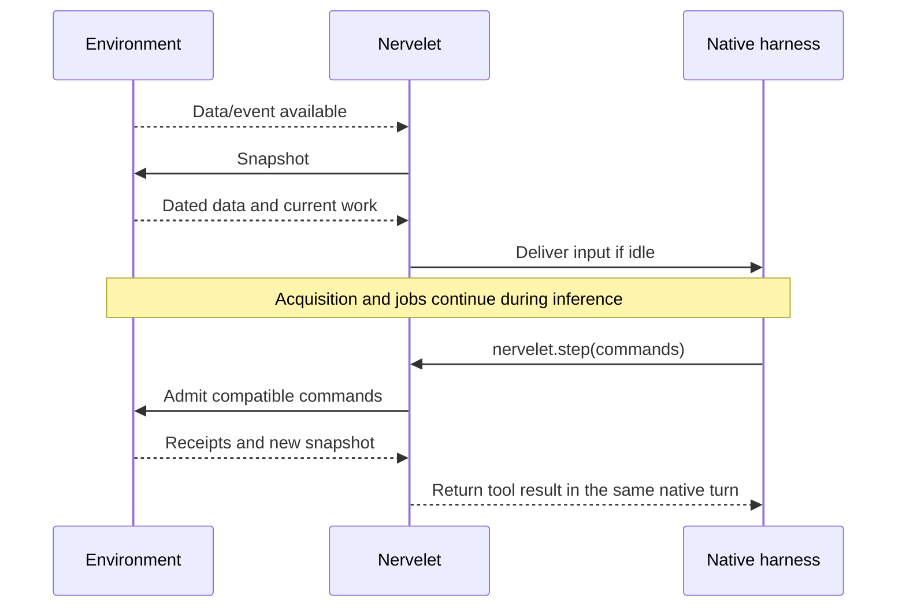

# Design: continuous environments, native agent sessions

**Specification · 2026-09-15 · Implementation pending.**

Nervelet supervises a native coding-agent session pursuing a goal in a changing environment. A robot is one environment; an API monitor is another. The core contains no vehicle, camera, game, transport-specific or model-specific logic.

A **harness** is the existing agent runtime, such as Codex or Claude Code. It already owns inference, native tool execution, conversation history and compaction. Nervelet connects that runtime to ongoing external data and work.

## 1. Packaging decision

Build a small TypeScript library, embedded in an application or hosted by a thin process. Use one package with module exports initially. A plugin is an optional installer for the tool bridge and native hooks. An Orchflows workflow can configure, launch and assess a run.

The [architecture comparison](docs/architecture-options.md) explains these choices. Neither plugin installation nor a workflow prompt supplies continuous data acquisition by itself.



The application owns deployment and the permitted domain. The core has two integration boundaries, `Harness` and `Environment`. Combine several sources inside an environment instead of creating a framework of independently scheduled microservices.

## 2. Single ownership and modules

| Module | Owns |
| --- | --- |
| `core/` | Logical loop identity, received goal, lifecycle, delivery cursor, refresh generation and wake coordination. |
| `harnesses/codex/` | Codex process/session binding, native tool bridge, instruction installation, lifecycle translation and supported native features. |
| `harnesses/claude-code/` | Equivalent Claude Code integration through its native SDK and hooks. |
| Environment adapter, supplied by the application | Data acquisition, current sample slots, unread event queue, domain schema, permissions on effects, commands and domain jobs. |
| `bridges/mcp/`, when needed | MCP encoding and transport. It owns no goal, job or session semantics. |

Start with one library; make the two harness dependencies optional. Planned exports are `nervelet`, `nervelet/codex`, `nervelet/claude-code` and, if needed, `nervelet/mcp`. These are proposed exports, not published packages.

An environment can compose polling APIs, pushed events and capture-on-request sensors. Reuse its existing queues and execution records. The core receives bounded views; it does not maintain another world database.

Native scripts/processes belong to the harness; domain jobs belong to the environment. Report execution references as `{owner, id}` and obtain status from that owner. Both can appear in one delivery bundle. Any script that affects the environment must use the same domain command admission path.

## 3. Integration surface

Illustrative interfaces; supporting record schemas are defined by their owning module.

```ts
interface Environment<State, Command> {
  profile: Profile<State, Command>;
  changes(signal: AbortSignal): AsyncIterable<ChangeNotice>;
  snapshot(after: Cursor, signal: AbortSignal): Promise<Snapshot<State>>;
  acknowledge(cursor: Cursor): Promise<void>;
  submit(command: Command, context: CommandContext): Promise<Receipt>;
  cancel(ref: ExecutionRef): Promise<CancelResult>;
}
```

`changes` announces available data/events or relevant transitions. It is a wake signal; the payload to deliver comes from `snapshot`. The environment owns latest samples and ordered unread events. `snapshot` can attempt a new capture where the source profile requires one. A read-only environment advertises no commands.

The harness boundary opens or attaches a session, binds tools, submits input when idle, exposes lifecycle/execution events, restores instructions, interrupts and closes. Backend details remain in [Codex](docs/harnesses/codex.md) and [Claude Code](docs/harnesses/claude-code.md).

Illustrative assembly:

```ts
const loop = createLoop({
  harness: codex({ /* native model, permissions, workspace */ }),
  environment: apiMonitor({ /* polling and event sources */ }),
  goal: { text: "Investigate failed builds until the service is stopped." },
  limits: { /* observation deadline, context, storage, cost */ }
});
await loop.run({ signal });
```

The same core can use a DroneRTS environment or Claude Code harness. No raw model-provider abstraction is needed when all agents run through native harnesses.

## 4. Continuous acquisition, bounded decisions

Keep three activities independent:

1. The environment acquires data on its own schedule.
2. The harness runs the model and native tools.
3. Accepted jobs execute and report progress.



Keep one active inference invocation per logical loop. A tool result resumes the current native inference loop; it does not launch another agent turn.

While the harness is busy, coalesce sample-change notifications into one pending wake. Preserve unread events. On idle, deliver a snapshot if relevant events or a configured observation deadline require it. Rate-limit ordinary wakes; acquisition rate and model invocation rate are separate settings. Never interrupt on every camera frame.

A wait wakes for relevant events, cancellation or its bounded timeout. Sample-only changes need not wake it immediately. The timeout prevents a visual or API-only source from becoming invisible indefinitely.

Private file reads and native script tools do not automatically acquire external observations. Their results may make earlier evidence older. The next Nervelet step refreshes the environment view.

Native completion of a response is an idle state. The application decides mission completion from its criteria. Errors, budget exhaustion, pause, Stop and completion remain distinct; limits are not bypassed by restarting a session.

## 5. Agent-facing tools

```ts
nervelet.step({})                         // observe
nervelet.step({ waitMs: 2000 })           // event or bounded timeout
nervelet.step({
  goalVersion: 7,
  commands: [
    { id: "c18", kind: "inspect", args: { /* domain fields */ } },
    { id: "c19", kind: "report", args: { /* independent work */ } }
  ]
})
nervelet.cancel({ owner: "environment", id: "j12" })
```

Observe, wait and batch are separate forms; do not mix waiting with commands. Generate command schemas and operating instructions from the environment's canonical profile. Batch size and source requirements are configured limits, not game rules.

**Batch semantics:**

- Validate compatibility, authority, received goal version and capabilities. Return a receipt for every entry.
- Admit in listed order. Admission does not wait for physical or remote completion. Valid independent jobs can overlap.
- The domain owns exclusive resources and explicit replacement rules. A robot may allow only one movement writer.
- Partial failure does not roll back completed effects. Newly acquired capabilities become usable after refreshed state.
- Dependencies requiring completion belong in an ordered domain job or authored routine. Dependencies requiring new evidence need another step.
- The effect owner deduplicates bounded command IDs. Unknown/expired receipts stay unknown; never blindly repeat an uncertain mutation.

A native `await` follows the called API's semantics: awaiting admission is not awaiting completion. Expose both submission latency and execution progress; label optional ETAs as estimates.

Cancellation dispatches directly to the owner before waiting for capture or ordinary tool queues. Stop also has a host-side path independent of model inference.

## 6. What a bundle contains

| Field | Contract |
| --- | --- |
| Header | Loop identity, schema/profile versions, sequence, clock epoch, delivery time and lifecycle. |
| Goal | Exact received text, version and status. Goal size is bounded at admission; no silent shortening. |
| Results | Per-command outcomes and execution references. |
| State | Timestamped domain-owned current status. An API monitor might expose queue depth; a robot might expose pose, velocity, cargo and equipment. |
| Observations | Named samples with acquisition time, validity, source identity and typed text/image/data content. |
| Executions | Bounded current status from harness and environment owners: running work, progress, reason and source references. |
| Events | Exact unread slice, cursor and `hasMore`. |

The core requires neither a camera nor a `velocity` or `cargo` field. Environments define the state and source schemas. DroneRTS supplies all of its own-state fields every step.

“Latest available” does not mean “acquired now.” A source profile specifies polling, streaming or fresh capture at each step. Failed acquisition is explicit; never label a cached image as newly captured. Images use native multimodal content blocks.

Keep latest values for replaceable samples; retain discrete events in bounded ordered queues. Mark gaps in lossy streams; apply backpressure to reliable events. Preserve event IDs across retry. Acknowledge only backend-confirmed inclusion; uncertain delivery can be repeated with the same IDs. Inclusion is not comprehension or agreement.

Do not send every intermediate frame, full logs or the workspace directory. Deliver a compact complete current state rather than deltas requiring forgotten history. Preserve required precision and validity. Lossless deduplication stays within a bundle.

## 7. Staleness and goals

Every observation is evidence from a named time and source. Receipt time, repeated text and compaction do not refresh its evidence time. Track monotonic acquisition/delivery clocks with epochs; add simulation time when relevant. Clock synchronization across hosts must be explicit.

At command admission, evidence is older by the inference and transport delay. The domain can require an observation reference and a maximum age for particular commands. Age validation bounds delay; it does not prove the world stayed unchanged.

| Example | Observation | Later decision |
| --- | --- | --- |
| API monitor | Build B was queued at t=10. | At t=16, read current build state before an action that depends on it still being queued. |
| Robot | Image 42 shows an object at t=100. | Its current location is unknown if it has moved out of the next view. |
| Local execution | Job J12 was accepted. | Current progress and domain status establish what it is doing; acceptance alone does not. |

If inference exceeds the task's reaction window, use an explicitly available local routine/controller or accept the capability limit. Nervelet supplies no implicit perception, tracker or planner.

Only explicit authorized updates replace goals. By default, activate a goal upon confirmed delivery to that loop, serialize the change with command admission, cancel affected old-goal work and reject old-version commands. The application may configure earlier activation with commands blocked until delivery. Ordinary messages never implicitly replace goals. Emergency Stop does not wait for goal delivery.

## 8. Compaction and recovery

Native history provides continuity. Exact sources provide correctness.

| Must remain exact | Owner and delivery |
| --- | --- |
| Loop contract, identity, schemas and domain calibration | Native instruction configuration generated from the profile; restore after context loss. |
| Received goal | Core record; repeat exact text/version each step. |
| Active command parameters, source versions and IDs | Execution owner; compact status normally, exact active specification on recovery or lookup. |
| Authored code and essential commitments | Private files; restore an optional short `working.md`, read other files on demand. |
| Current external state | Acquire again; old snapshots are historical. |

On startup, resume, compaction or profile change:

1. Mark a new refresh generation.
2. The harness adapter ensures exact operating instructions and schemas are available.
3. The next step returns fresh state, exact goal, active specifications and the saved note. Withhold submitted mutations with `not_executed: refresh_required`.
4. Clear only the matching delivered generation. Let the model decide again; never replay withheld commands.

Cancellation remains available. Existing jobs continue only while their owner's authority and execution conditions remain valid. Native session failure, environment/controller failure and normal model thinking are different conditions.

Do not rebuild summaries, transcripts or a memory database. Update a small private note when an important intention or commitment changes. Preserve source/time/uncertainty for hypotheses; a missing note stays missing. Keep untrusted observations and peer text at their original authority when restoring context.

An adapter must expose reliable recovery boundaries. If it cannot, report that unattended compaction recovery is unsupported. Process restart adds reconciliation: reopen native state where supported, query execution owners, reacquire observations and never replay historical side effects.

## 9. Native features without competing owners

Reuse native files, search, execution, planning, context and session APIs. Keep optional native controls in typed backend-specific configuration; report requested unsupported features before starting.

Native tasks/plans describe agent intent. Native goals may display the application's received goal but do not independently overwrite it. Native background executions retain their original owner and IDs. Native subagents are optional harness capabilities, with independently verified isolation and recovery.

Default deployment gives each loop a dedicated native session. An existing application may attach its own root/child sessions through the same adapter contract, provided it reports lifecycle and grants only scoped tools. Exactly one supervisor binds each logical loop. DroneRTS retains its existing actor topology.

## 10. Implementation order and proof

Start with native async iterators, `AbortSignal`, bounded queues and explicit lifecycle state. Add libraries only where measured complexity warrants them; see [dependency choices](docs/architecture-options.md#related-projects-and-dependencies).

1. Implement core and a deterministic API-only environment. No robot fields, images or native inference should be necessary.
2. Implement and qualify the Codex adapter, then the Claude Code adapter, against the same contract suite.
3. Integrate DroneRTS as the canonical application without moving game rules into core.
4. Add plugin packaging or Orchflows examples when a real launch workflow needs them.

Verify independent acquisition during inference; bounded/coalesced wakes; full batch outcomes; stale and missing data; uncertain delivery; duplicate effects; goal/admission races; prompt Stop; and at least three automatic/manual compactions with work in progress.

Measure model tokens, image contribution, decision delay, acquisition age and useful progress separately. Run actual harness tests before claiming native support, and application trials before claiming autonomous performance. Documentation and deterministic fixtures do not establish hardware readiness.
