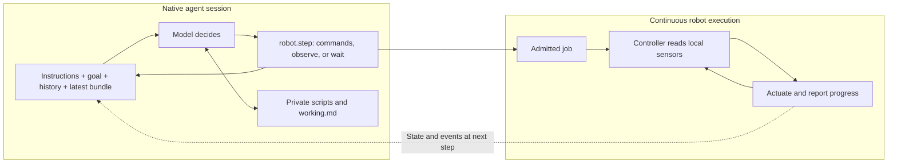
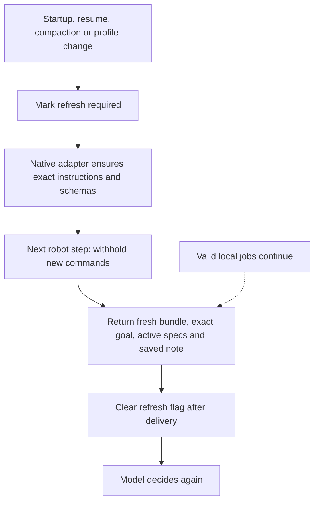

# Design: the robot loop

**Specification · 2026-09-15 · Runtime implementation pending.**

Start with the [README](README.md). [DroneRTS integration notes](docs/dronerts.md) describe the originating application.

Use one persistent native agent session per robot, a timestamped observation bundle, asynchronous jobs, and a private workspace. Keep the coordinator small enough to audit. Codex and Claude Code retain their own inference, tool execution and compaction machinery.

**The agent knows the latest delivered evidence. It cannot know the instantaneous world while it is thinking.** Make that limit explicit, and let local controllers handle continuous execution.

## 1. Two loops, different speeds



A **decision cycle** is model output → tool execution → returned evidence → another model decision. It can contain several tool calls. A physical job can span many cycles.

During inference, local jobs and the world continue. New observations and messages become model input at supported runtime boundaries; they do not continuously rewrite an in-progress inference. When the agent has no immediate work, it requests a bounded wait. Events wake it early; the timeout ensures visual re-observation even when nothing generates an event.

A native agent finishing a response does not finish the robot's mission. The coordinator resumes an active mission on the next event or observation deadline, with one inference invocation active per robot. Completion, Stop, errors and budget exhaustion are explicit lifecycle states; do not endlessly restart a failing session.

## 2. Direct answers

| Question | Answer |
| --- | --- |
| What information does the model receive? | Native instructions, enabled tool schemas, current goal, conversation or compacted history, returned text/images, and files it reads. Files are not automatically all in context. |
| Can it batch actions? | Yes, through an explicit robot batch. Native runtimes also support multiple calls, but their scheduling differs. A robot batch defines predictable admission and one shared observation boundary. |
| Does it understand its loop? | It can reason from the supplied contract and receipts. It has no privileged knowledge of execution progress, hidden sensors or actual latency. Verify behavior rather than assuming understanding. |
| Does it know how long movement takes? | Admission latency and travel duration are separate. Return job progress and measured timestamps; an ETA, when available, is an estimate. `await submit()` means admitted, not arrived. |
| Does fresh sensor data include held items? | Yes: repeat current own inventory/equipment, cargo, resources and service status alongside pose, velocity and jobs. |
| Does every sensor update include a camera image? | High-rate controller updates need not. Each model-facing robot step attempts a fresh image for a camera-enabled profile. Native file reads do not implicitly capture the world. |
| Can it tell it is still moving? | Supply both physical velocity and execution state. A blocked/cancelled job may still be braking; a running job can be stationary. |
| Can it remember a moving enemy? | As a dated sighting or hypothesis. A remembered location is not current telemetry. New evidence must support any updated position. |

The native tool-result cycle and session continuation are documented in [Codex App Server](https://learn.chatgpt.com/docs/app-server) and the [Claude Agent SDK loop](https://code.claude.com/docs/en/agent-sdk/agent-loop). Robot sensing and execution semantics are this library's responsibility.

## 3. Single ownership

Three modules; ordinary files provide storage.

| Module | Owns | Interface responsibility |
| --- | --- | --- |
| `agent/codex` or `agent/claude-code` | Native session, instruction installation, tool registration, continuation and compaction notifications | Expose robot tools; report lifecycle; restore exact instructions through supported native mechanisms. |
| `core` | Per-robot received goal, lifecycle, delivery cursor and refresh flag | Validate the envelope, coordinate delivery, wake the session, assemble one bundle. It does not interpret the scene or plan actions. |
| `robot/<profile>` | Sensing, calibration, command schemas, execution records, actuator ownership and limits | Acquire permitted observations; admit/cancel commands; report jobs/events; run local control. |

The native workspace holds authored code and one optional `working.md`. Reuse existing isolated storage and queues. Core needs small records, not a memory database.

Generate tool definitions and operating instructions from the robot profile's canonical definitions. Do not independently copy units, limits or command semantics into several prompts. Profile changes are versioned and force refresh.

Keep the portable boundary narrow: typed commands/results and multimodal bundles, transported through MCP or the backend's custom tools. Native filesystem and execution features remain available **within the robot's configured permissions**. All actuator access, including agent-authored scripts, goes through the same robot adapter.

## 4. Two tools

```ts
robot.step({})                                  // observe now
robot.step({ waitMs: 2000 })                    // event or bounded timeout
robot.step({
  goalVersion: 7,
  commands: [
    { id: "c18", kind: "move", args: { /* profile-defined */ } },
    { id: "c19", kind: "send", args: { /* independent message */ } }
  ]
})
robot.cancel({ jobId: "j12" })                  // urgent cancellation
```

`step` has three forms: observe, wait, or command batch. Do not mix a wait with commands. The profile defines command kinds and limits; start with at most eight compatible commands. Domain convenience tools may call this same implementation.

**Batch contract:**

- Check compatibility, goal version and capabilities before admission. Return an outcome for every entry.
- Admit entries in listed order; do not wait for physical completion between entries. Actual work may overlap.
- One writer per actuator resource. For a drone, one movement writer. Replacement must explicitly identify the work being replaced.
- Admission failures do not roll back earlier effects. A newly purchased capability is usable after its receipt and refreshed capability state.
- Completion dependencies belong in an ordered job or an authored routine. An operation needing an intermediate image requires another step.
- Use command IDs for bounded duplicate detection at the effect-owning adapter. Never automatically replay an uncertain mutation; query its recorded outcome. An expired/unknown receipt remains unknown.

Cancellation takes effect before waiting for sensors or encoding an image. External Stop reaches the controller independently of the model and the normal tool queue.

### Every step returns

| Section | Compact contents |
| --- | --- |
| Header | Session/clock epoch, sequence, schema/profile version, lifecycle and delivery time. |
| Goal | Exact currently received goal text, version and status. Keep goals brief when authoring; never silently summarize an incoming instruction. |
| Results | Per-command admitted/rejected outcome, command/job IDs and reasons. |
| Self | Timestamped pose, velocity, orientation, held items/equipment, relevant resources/services and storage capacity. |
| Samples | Sensor values/images, acquisition times, frame/units/calibration references and validity. |
| Jobs | Active work: ID, owner, state, goal version, progress/reason and compact command/source reference. Terminal transitions also enter the event queue. |
| Events | Bounded ordered slice of unread messages/transitions, cursor and `hasMore`. |

The image is an image content block, not base64 pasted into text. Different sensors may have different acquisition times; a bundle is a delivery envelope, not a claim of simultaneous measurement. Missing capture returns an explicit error, never a relabeled old frame.

Sensor samples use a **latest-value slot**: obsolete intermediate frames can be replaced while the model thinks. Unread messages and terminal events use a **bounded queue**: preserve them until delivery, with backpressure at capacity. Inclusion is distinct from understanding, agreement and completed action. Transport retries preserve event IDs; only acknowledged included events advance the cursor.

## 5. Staleness without a memory system

Use three simple rules:

1. **Self-state is refreshed.** Each step is self-contained for current state; do not require a previous delta baseline.
2. **World claims retain their evidence time.** “Drone seen in image 42 at t=100” stays historical until observed again. A later conversation summary or repeated peer report does not refresh it.
3. **Controllers check current execution conditions.** A fresh-looking model receipt cannot substitute for ongoing local sensing.

Track monotonic acquisition/delivery times in a named clock epoch. For simulation, also carry simulation time: pause or speed changes affect physical aging differently from host delays. Never subtract timestamps from unrelated robot clocks without a declared synchronization mapping.

`ageAtDelivery` is only age at delivery. Actual evidence age when a command is admitted includes subsequent inference and transport delay. The adapter can measure that delay; the model cannot predict it reliably.

For commands that require recent evidence, the robot profile may require an observation reference and a maximum admissible age. Check these at admission and reject with a fresh bundle when stale. This bounds age, not whether an object remained in place. Do not impose one universal expiry on goals, maps, radio reports and moving objects.

### Worked moving-world example

Illustrative times, at 1×; this is not a new playtest.

| Time | What happens | Correct interpretation |
| --- | --- | --- |
| 100.0 | Image 42 shows another drone. Own route J12 is running. | The sighting is evidence at 100.0. |
| 100.2–106.0 | The model reasons and reads a script. Both drones can move. | No new visual observation has arrived. |
| 106.1 | The model submits a command requiring image age ≤1 s. | Adapter rejects it as stale; returns image 43 and current jobs/self. |
| 106.3 | Image 43 no longer shows the other drone. | Its current position is unknown; absence from view is not proof it disappeared. |

If inference consistently takes longer than a task's reaction window, repeated observations alone cannot solve it. Use an explicitly available local perception/control routine, or accept the capability limit. The library supplies no implicit tracking, object classifier or global world model.

A [recorded DroneRTS trial](docs/dronerts.md#recorded-timing-evidence) measured multi-second decision gaps even without compaction. This motivates explicit timestamps and execution state; it does not validate this library.

## 6. Compaction: preserve sources, refresh facts

Do not require the compactor to preserve exact text. Preserve authoritative sources outside summarized history and restore them.

| Information | Exact source | Delivery policy |
| --- | --- | --- |
| Identity, loop contract, units, limits, tool semantics | Versioned robot profile and native instruction configuration | Install at startup; preserve/reinstall after compaction, resume or profile change. |
| Received goal | Core's exact per-robot goal record | Repeat exact text/version each robot step. |
| Running command arguments, IDs, code version/hash | Robot execution record and private files | Compact status each step; exact active specification on recovery or explicit lookup. |
| Code and essential commitments | Private files, optionally exact quotations in `working.md` | Exact bytes persist; restore the small note after recovery, read other files on demand. |
| Current world/self-state | Sensors and robot state | Acquire again. Old snapshots do not become restored current facts. |
| Reasoning, hypotheses and history | Native context and optional note | May summarize, retaining source/time/uncertainty where still relevant. |

**Repeat the small goal and current state; retain the operating contract in native instruction context.** Do not append the whole manual, scratchpad or transcript every step. A profile hash alone cannot teach forgotten semantics.



If the first step contains commands, return `not_executed: refresh_required` for them. Never replay them automatically. Cancellation remains available. Mark refresh as soon as compaction starts; clear it only for the matching completed recovery, so another compaction cannot race an earlier delivery.

This requires a backend lifecycle signal and verified instruction restoration, not a second summarizer. A backend without those capabilities must report the limitation rather than claim reliable unattended compaction recovery. An exact note is optional; a missing note is empty context, not permission to invent a plan.

Example agent-authored note:

```text
Intent: finish the currently chosen delivery.
Evidence: possible drone in image 42 at sim 100; current location unknown.
Commitment: peer message m18 requested a reply after delivery; pending.
Code: inspect.js; execution state comes from the next bundle.
```

Update the note when an important intention or commitment changes. Do not copy each sensor batch or require a write every step. Save essential information when acquired, since automatic compaction can precede a planned checkpoint.

## 7. Goal changes and native integration

Only an authorized explicit goal update changes the goal record. Ordinary chat remains an event.

By default, activate the new goal when its exact instruction is actually included for that robot. Serialize that activation with command admission: cancel affected old-goal work, reject old-version mutations, and return the exact new goal. Keep queued, delivered and acted-upon states separate. Emergency Stop is independent of goal delivery.

A different robot can define a different activation policy in its profile, but must expose it explicitly. The application supplies completion evidence/criteria. A model's final sentence alone does not end an ongoing mission.

| Native feature | Integration |
| --- | --- |
| Sessions and compaction | Keep one native conversation; let the backend compact it. Persist the session identity within the deployment's lifetime. |
| Files and code execution | Use the native/private workspace. Register robot-controlling code as adapter-owned jobs so execution remains visible and cancellable. |
| Plans, todos and native goals | Use for agent-owned planning or a derived view of the received goal. They do not independently overwrite the application's authoritative goal. |
| Hooks and lifecycle events | Normalize startup/resume/compaction/completion into core lifecycle events. Test the installed version and actual root/child actor type. |
| Multiple tool calls | Keep native scheduling for independent file work. Robot batch semantics remain explicit and backend-independent. |

Codex exposes compaction lifecycle items; its documented `SessionStart(source=compact)` recovery hook applies to root sessions, including automatic mid-turn compaction. Test native children separately. [Codex hooks](https://learn.chatgpt.com/docs/hooks#sessionstart), [App Server](https://learn.chatgpt.com/docs/app-server).

Claude's Agent SDK supports session resume and reports a compaction boundary. Hook availability differs between TypeScript and Python; do not assume identical adapters. [Sessions](https://code.claude.com/docs/en/agent-sdk/sessions), [loop lifecycle](https://code.claude.com/docs/en/agent-sdk/agent-loop), [hooks](https://code.claude.com/docs/en/agent-sdk/hooks).

Useful precedents: ROS 2 actions separate admission, feedback, cancellation and results; Code as Policies demonstrates authored programs calling perception/control APIs. Borrow those interface ideas; neither dependency is required. [ROS 2 actions](https://design.ros2.org/articles/actions.html), [Code as Policies](https://arxiv.org/abs/2209.07753).

### Minimal operating instruction

> You control this robot through its tools. Follow the exact received goal. Each robot step returns dated observations, current self-state, jobs and unread events. The world and valid jobs continue while you think, use files or wait. Admission is not completion; velocity describes physical motion. Batch independent commands; use jobs for dependencies. Treat sightings and notes as dated evidence. Preserve important intentions and commitments in your private note. On refresh, reconcile it with current state. Wait with a bounded observation deadline when no immediate work remains.

Append the canonical vehicle profile and tool schemas once through native instructions. Do not require a narrated checklist or explanations of private reasoning.

## 8. Delivery criteria

Implement the portable contract independently of any application. Application-specific tool mappings and restrictions belong in robot adapters; see [DroneRTS](docs/dronerts.md) for the first integration target.

**Token policy:** short meaningful keys; one copy of each value per bundle; lossless same-bundle deduplication; bounded event slices; no repeated file contents. Keep current full self-state and required sensor fidelity. Measure tokens, image cost, decision delay and useful progress separately; byte savings alone prove neither token savings nor faster decisions.

Before calling the library ready, verify:

- One session can cross at least three manual/automatic compactions while work and the world change; exact instructions/goal/code survive and fresh state wins over old notes.
- A job completes during thinking, waiting or compaction; its result arrives once logically, without repeating the physical action.
- Stale evidence, missing images, clock reset and delayed/duplicate events are explicit.
- Batches return all outcomes; dependencies, competing writers and uncertain retries cannot create hidden duplicate effects.
- Goal changes race safely with admission; Stop interrupts waits/capture and cancels execution promptly.
- Long runs stay within queue/workspace/receipt budgets. Test each native backend and root/child mode independently.

Start with deterministic protocol tests, then bounded real-agent trials for actual understanding and task progress. This document makes no new autonomy or hardware-readiness claim.
