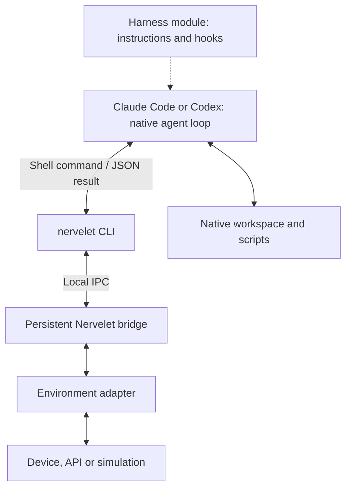
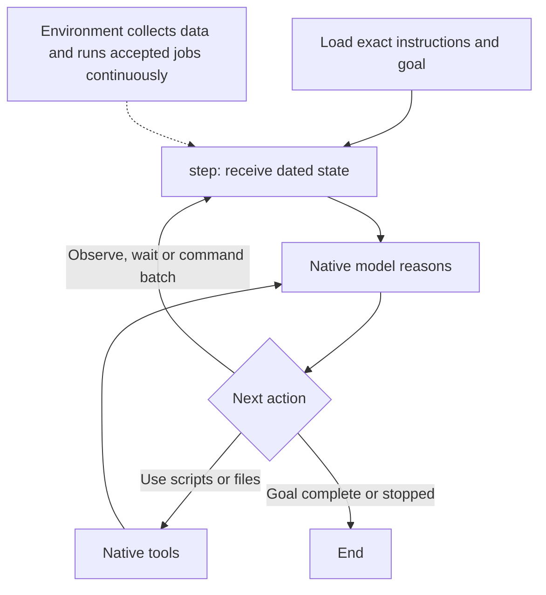
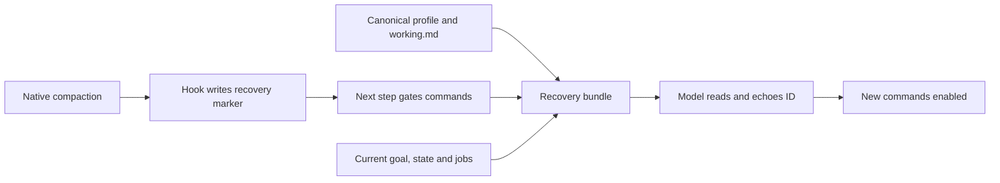

# Design: one agent, one bridge

**Implemented v0.1 · 2026-09-15.** [Validation and current limitations](docs/validation.md).

Nervelet connects one native coding-agent session to a changing environment. A local CLI runs through the harness's shell tool. A small persistent bridge maintains device/API connections while the model thinks.

## 1. Architecture and ownership



| Owner | Responsibility |
| --- | --- |
| Native harness | Model calls, conversation, compaction, shell/file tools and background processes. |
| Nervelet core | Goal record, lifecycle, bounded batches/receipts, delivery acknowledgements and recovery gate. |
| Environment adapter | Acquisition, latest samples, unread events, domain schema, command admission and domain jobs. |
| Harness module | Install instructions/hooks; translate supported recovery and end-of-turn boundaries. |

One TypeScript package contains `core`, `cli`, `harnesses/claude-code` and `harnesses/codex`. Applications supply an environment adapter; serial support is optional. The same core can be embedded in a simulator instead of running as a separate bridge process. [Adapter API](docs/api.md).

The CLI is a short-lived client of the bridge. Use a local socket/named pipe; do not reopen the serial device each step. These are ordinary local requests, with no MCP protocol. Native scripts use the same request client. Only the adapter writes to the device.

Initial scope excludes subagents, workflow engines, a plugin system, a memory database and a second inference scheduler. Nervelet does not call raw model APIs.

## 2. The actual loop



A tool result becomes input to the next model invocation within the same native session. The LLM does not continuously perceive between invocations. It understands timing and execution semantics through instructions and returned evidence.

Acquisition, model/tool work and accepted domain jobs overlap. A 100 Hz sensor does not require 100 model calls per second. Keep its latest sample; retain distinct events separately. A bounded wait returns on a relevant event or timeout. Sample-only changes need not wake every wait. No model inference is required during the wait.

`waitMs` bounds the waiting period, not total tool latency: native process startup, IPC, snapshots and model scheduling add time. Default adapter-operation timeout is 2 s, startup 10 s and wait limit 30 s. The LLM learns timing from instructions and returned timestamps; it has no automatic private view of device execution.

**Freshness boundary:** every Nervelet step returns a new snapshot of available data. A native file read or script edit does not refresh external data. Automatic injection after arbitrary tools is deferred.

The agent continues by calling `step` again. A native Stop hook may give a bounded reminder when an active loop ends prematurely. It must respect explicit Stop, interrupts, errors and budgets. Hooks cannot restart a closed harness or guarantee perpetual operation. Initial support targets a live native session; a finished response alone does not prove the external goal is complete.

## 3. Small command surface

CLI:

```sh
nervelet step                         # observe
nervelet step --seen RECEIVED_BUNDLE_ID --wait-ms 2000
nervelet step --request request.json  # compatible command batch
nervelet cancel j7                    # request cancellation from job owner
nervelet stop                         # end loop and cancel affected work
```

Example request file, written with native file tools:

```json
{
  "seen": "RECEIVED_BUNDLE_ID",
  "goalVersion": 3,
  "commands": [
    { "id": "c8", "kind": "set_led", "args": { "on": true } },
    { "id": "c9", "kind": "sample", "args": {} }
  ]
}
```

Observe, wait and command batch are separate step forms. At most eight entries yield individual receipts and one observation bundle. This works even if a harness schedules shell calls sequentially. Use one in-flight step per agent and actual IDs/version from received output.

- Validate authority, goal version, compatibility and capabilities.
- Admit entries in order without waiting for long jobs to finish. Return a receipt for every entry; independent jobs may overlap.
- Partial failure has no rollback guarantee.
- Dependencies needing completion belong in an ordered domain job or native script. Dependencies needing new evidence require another step.
- The adapter enforces exclusive resources and explicit replacement, such as one movement writer.
- Use increasing `cN` IDs from `nextCommandId`. Same-ID/same-arguments retries return retained receipts. Changed arguments are rejected; expired/out-of-order IDs report unknown without executing. Never automatically repeat an uncertain effect.

Awaiting admission differs from awaiting completion. Return `accepted` and a job ID promptly; later snapshots report `running`, `completed`, `blocked`, `cancelled` or `failed`. Report durations when measured and label ETAs as estimates. Physical state is separate: a finished shell call can leave a robot moving.

`loop: paused` gates **new commands**; it does not mean the device is stationary. Valid accepted jobs continue during reasoning and compaction. The demo reports measured start/update times, not predicted ETAs.

```mermaid
sequenceDiagram
    participant A as Native agent
    participant B as Bridge
    participant D as Environment
    A->>B: step: LED + 200 ms movement
    B->>D: Admit LED, then movement
    D-->>B: completed; accepted job j1
    B-->>A: Receipts, velocity, j1 running
    Note over A,D: Model reasons; acquisition and j1 continue
    D-->>B: j1 completed event
    A->>B: step with previous seen ID
    B-->>A: Latest state and j1 completed
```

Cancellation and Stop bypass ordinary waits/capture queues. Device-local control and watchdogs own time-critical behavior; model keep-alives must not be necessary for valid local work. The adapter specifies what controller loss or Stop does to each job.

## 4. The compact bundle

| Content | Send |
| --- | --- |
| Header | Bundle ID, clock epoch, schema/profile version, delivery time and loop status. |
| Reminder | One fixed short sentence about step, timing and job semantics. |
| Goal | Exact bounded text, version and status. |
| Own state | Current domain status, acquisition time and validity. |
| Samples | Latest relevant values, source ID, acquisition time and validity. |
| Jobs and results | Active domain jobs, progress/reason and per-command receipts. |
| Events | Bounded unread slice, stable IDs and `hasMore`. |
| Recovery | Exact operating instructions, generation and optional note; only until acknowledged. |

A robot adapter supplies its measured equipment, held items, cargo, pose or velocity. An API monitor might supply queue depth. No robot field is mandatory. Missing telemetry means unknown, not zero or stationary.

Send complete compact current state; avoid deltas requiring remembered history. Omit empty optional collections, verbose logs and directory listings. Bound goal/profile size at configuration time instead of silently truncating instructions. Preserve required units, precision and invalidity.

The default bundle cap is 32 KiB, a byte bound rather than an exact token count. Profiles must fit alongside recovery state and jobs. Oversized output fails explicitly. The provided store caps unread events at 256/64 KiB; it returns backpressure instead of evicting them.

The environment stores samples/events once; the core tracks delivery. Stdout success alone does not establish model receipt. The next agent step echoes the previous bundle's `seen` ID; acknowledge only events included in that bundle. Redeliver uncertain events with stable IDs. Scripts must not auto-ack output the model never received. This establishes receipt, not comprehension or agreement.

Bound storage and report backpressure. Samples may coalesce; reliable unread events must not silently disappear. Mark gaps in lossy streams. Bound the bundle-to-event mapping; reject unknown/expired acknowledgements explicitly.

### Camera and ongoing execution

A future camera adapter can choose latest streaming frame or capture-on-step. **v0.1 contains no camera adapter or automatic image delivery.** A newly assembled snapshot is not necessarily a newly acquired measurement. Preserve capture time and report acquisition failure.

The intended shell path returns an immutable image path and matching metadata. The agent then uses its native image-reading tool. A path or base64 text in stdout is not itself visual input. The frame and associated sensors retain their capture ID even if the world moves before the image is read. Frame-file retention and expiration require a separately implemented adapter.

Same-result images require a separately qualified native multimodal bridge. Initial Arduino scalar sensors need none. DroneRTS currently delivers images through MCP; its eventual transport change must preserve its observation contract.

Domain job status comes from the adapter. Native shell task status stays in the harness's tool results; do not duplicate its process registry. Scripts causing device effects still use the adapter's command path.

## 5. Stale evidence and changing goals

Acquisition, delivery and command-admission times differ. Use monotonic clocks with a restart epoch; preserve device timestamps separately unless synchronized. Unsynchronized clocks alone cannot establish acquisition age; report uncertainty or use an explicit transport-age bound. Simulators may add simulation time.

`maxAgeMs` invalidates old **receipt** time. It cannot detect a delayed frame that arrived recently. The adapter must establish acquisition-age guarantees when required.

An image showing a moving object at X at t=10 does not establish its position when a script finishes at t=15. Reacquire before targeting. An adapter may reject commands whose required observations exceed a maximum age; the generic core has no tracker or stale-target veto. Age checks cannot prove the world stayed unchanged. Reactions faster than inference require available local control.

An authorized explicit goal update creates a new version. The simple default pauses new effects and cancels affected old-goal jobs, delivers the new goal, then enables new-version commands after acknowledgement. Serialize updates with command admission. Chat alone does not replace goals; explicit Stop acts immediately. DroneRTS retains its application rule of activating objectives on actual per-drone delivery.

## 6. Compaction: keep exact sources small

Do not require crucial facts to survive verbatim inside a conversation summary.

| Exact source | Delivery |
| --- | --- |
| Operating contract, command schema, units and calibration | Adapter profile, generated `.nervelet/profile.md` and exact `recovery.instructions`. |
| Current goal | Core record; repeated every bundle. |
| Active job specification | Adapter record; short status normally, exact arguments on recovery. |
| Code and important commitments | Native workspace; optional short `working.md` restored on recovery. |
| Current environment | Reacquire; old snapshots remain historical evidence. |

Repeat a tiny reminder each step: “Step refreshes observations; native file tools do not. Accepted jobs may still run. Use observation timestamps. Wait when idle; stop ends the loop.” The complete manual need not accompany each sample.

On start, resume or compaction, the hook writes a durable refresh marker and injects a short reminder. The next step gates commands and returns the exact profile, current state, goal, active job details and optional `working.md` (at most 4 KiB). This avoids harness-specific truncation of a large hook result. A subsequent step acknowledging that recovery bundle may issue newly decided commands. An older acknowledgement cannot clear a newer recovery generation. Changing the profile requires restarting the bridge.



Ordinary thinking and compaction do not automatically cancel valid jobs. Stop, controller failure and invalid execution conditions follow domain cancellation rules. Native hook failures remain native failures; installation alone does not prove recovery ran.

The bridge is a persistent process, not a durable event database. A restart creates a new epoch and loses in-memory unread events, receipts and job records. Startup recovery states this explicitly. `.nervelet/goal.json` records the last goal; it does not automatically restore a run. The serial adapter obtains a confirmed device Stop before accepting new commands. History is not a recovery script.

Qualify hooks on the supported harness version. If recovery boundaries cannot be observed reliably, report the limitation. Keep external sensor text and saved hypotheses at their original authority; trusted hooks must not promote them into instructions.

## 7. Integration contract

An environment supplies a versioned profile, continuous acquisition, bounded snapshots/events, command submission and cancellation. A harness module supplies native instruction installation, recovery notification and a bounded continuation hook.

Use native promises, async iterators and `AbortSignal`. The CLI and embedded API call the same core handlers. There is no generic model-provider or native-tool framework. Details belong in the [Claude Code](docs/harnesses/claude-code.md) and [Codex](docs/harnesses/codex.md) modules.

Timeouts require cooperative adapters: honor cancellation and keep synchronous work short. Blocking Node's event loop prevents prompt cancellation. Firmware/local controllers own watchdogs and physical deadlines. The local CLI is a trusted-project integration, not an isolation sandbox for adversarial actors.

## 8. Proof and remaining work

The bridge, CLI, harness modules, demo, serial protocol and Arduino firmware are implemented. Deterministic tests cover repeated recovery with running work; a real Claude Code session completed a command batch and observed its job finish. Codex qualification is partial. [Validation](docs/validation.md) distinguishes actual native runs, simulated compactions and compiled-but-unflashed firmware.

Remaining qualification: actual repeated native manual/automatic compactions, Codex's complete scenario on a working native sandbox, and physical Arduino testing. [DroneRTS](docs/dronerts.md) and camera delivery remain separate integration work.

Test acquisition during inference, bounded output, stale/missing data, batch partial failure, uncertain receipts, duplicate commands, goal-change races, prompt cancellation and three successive compactions with a running job. Check model-visible content, not merely emitted stdout.

Measure tokens, observation age and useful progress separately. Documentation and deterministic fixtures do not establish autonomous or hardware performance.
