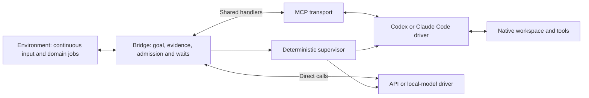
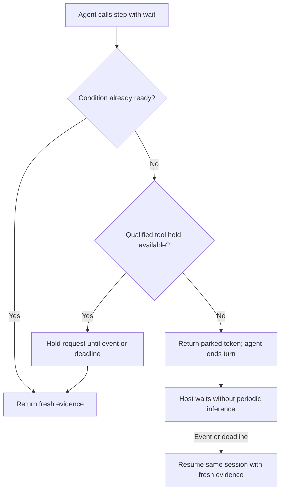
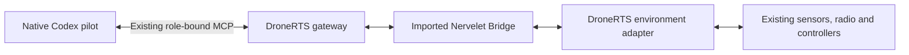

# Nervelet: TypeScript refactor handoff

**Accepted direction · 2026-09-15 · proposed behavior, not implemented**

**Implementation update, 2026-09-15:** Phases 0–4 are implemented in v0.2 with deterministic compatibility/protocol evidence. This handoff remains the original design record; its future-tense passages are not a current status claim. Read [the implementation guide](docs/v2.md) and [validation](docs/validation.md) for exact scope and native/hardware qualification gaps. The engineer, Python adapter and other optional follow-ons remain deferred.

## 1. Objective and scope

Refactor the existing TypeScript Nervelet into a small, embeddable library for one agent operating in a continuously changing environment. Preserve the working bridge, CLI, serial adapter and native installers while adding the shared tool contract, managed session lifecycle, images and direct-model support.

**Keep TypeScript as the only core implementation.** Python is an optional device-side adapter where Python libraries are useful. DroneRTS imports Nervelet into its existing Node process; no Python service or cross-language bridge is needed there.

The target combination is **core library + environment adapter + agent driver**. MCP is the preferred native tool interface. Native harnesses retain reasoning, files, tools and compaction. API/local models use the same handlers directly. Skills teach optional procedures; hooks connect lifecycle events. Neither owns correctness. The bounded engineer remains optional and disabled by default.

This replaces the earlier Python-first proposal and CLI-only future scope. [DESIGN.md](DESIGN.md), [docs/api.md](docs/api.md), [harness docs](docs/harnesses/codex.md) and [validation](docs/validation.md) describe implemented v0.1, not the refactor. [CONTRACT.md](docs/next/CONTRACT.md) is the normative behavior specification. [QUALIFICATION.md](docs/next/QUALIFICATION.md) defines acceptance. [RATIONALE.md](docs/next/RATIONALE.md) records research and Fable review decisions.

The next agent’s task is the **Nervelet library refactor**. Provide embedding examples and deterministic DroneRTS-shaped fixtures; actual DroneRTS gameplay migration is a separate task. Do not launch matches, change its rules or alter live sessions as part of this refactor.

## 2. Starting point

Repository: `~/tools/nervelet` (this workstation: `C:/Users/danhm/tools/nervelet`). Reviewed HEAD: `af0c1bfc3514aa8096eb2b7ba1fba0b1b7f92edd`. Recheck status and instructions before editing; preserve existing uncommitted work. Do not reset to this revision.

| Existing source | Refactor responsibility |
| --- | --- |
| [src/core.ts](src/core.ts) | Evolve `Bridge`: shared admission, receipts, recovery, goal transitions and logical waits |
| [src/types.ts](src/types.ts) | Canonical public contracts, typed attachments, lifecycle/driver capabilities |
| [src/store.ts](src/store.ts) | Optional environment-owned bounded storage; add change notifications without waking inference on every sample |
| [src/ipc.ts](src/ipc.ts), [src/cli.ts](src/cli.ts) | Preserve shell compatibility and administration; delegate to the same handlers |
| [src/harnesses/common.ts](src/harnesses/common.ts) and harness modules | Keep idempotent installation; separate native integration from semantic loop instructions |
| [src/adapters/demo.ts](src/adapters/demo.ts), [serial.ts](src/adapters/serial.ts) | Migrate adapters with compatibility tests; preserve device reconciliation |
| [test/core.test.ts](test/core.test.ts), [ipc.test.ts](test/ipc.test.ts), [serial.test.ts](test/serial.test.ts) | Retain meaningful baseline tests; extend for new semantics |

Today the core requires an initial goal, mixes CLI instructions into its profile, calls `snapshot` repeatedly, excludes commands-plus-wait, has no image transport, and treats admission exceptions as uncertain with a sticky fault. Native compaction qualification is incomplete. There are no managed/native SDK or API drivers. Build these incrementally; a filename or synthetic hook test is not proof of native functionality.

## 3. Architecture and ownership



Choose one operator driver. The supervisor is ordinary code, not another agent.

| Owner | Owns |
| --- | --- |
| Application | Goal authority, permissions, completion conditions, limits and domain policy |
| Environment | Acquisition, current state, reliable events, compatibility, device/job execution and physical stop |
| Bridge | Received goal/version, command receipts, observation acknowledgements, recovery and logical waits |
| Supervisor | One active operator turn, coalesced wakeups, bounded retries and session continuation |
| Driver | Harness/API mechanics, session identity, transport mapping and capability reporting |

One environment may compose many sources. Existing applications can supply supervision and session handles. Never start a second supervisor, device connection or inbox for the same actor. Explicitly distinguish resources Nervelet creates from borrowed host resources; closing one bridge must not kill a shared harness process or another actor.

Use three deployment forms:

- **Embedded:** host imports `Bridge`, supplies its environment and exposes shared handlers through existing tools. No daemon required.
- **Managed:** a convenience runner owns the bridge plus one driver and supervisor until stopped.
- **Attached:** install tools/instructions into a user-owned native session. Advertise its wake/restart limitations honestly.

## 4. Public surface and compatibility

Keep `Bridge`, `ObservationStore`, `serve`, `request`, `defineConfig` and existing installer exports where practical. Add separate driver/transport subpaths instead of changing what `nervelet/codex` or `nervelet/claude-code` currently mean. Do not introduce a parallel `Loop` implementation merely to rename the bridge.

Proposed internal additions, only when needed:

```text
src/
  core.ts, types.ts, store.ts, util.ts
  handlers.ts             # one tool dispatch/schema boundary
  instructions.ts         # semantic rules + transport-specific usage
  supervisor.ts           # managed lifecycle, no planning
  drivers/{codex,claude-code,api}.ts
  transports/mcp.ts
  adapters/{demo,serial,sequence}.ts
  harnesses/              # existing installers/hooks
  cli.ts, ipc.ts          # existing compatibility path
```

Keep Node 24+, ESM and the existing build/test commands. Use promises, async iterators and `AbortSignal`. Keep blocking work off the control path. Reuse Ajv and the command JSON Schemas; pin dialect handling explicitly and generate schemas/instructions from one registry. Do not add another validation framework or async scheduler.

Expose `step`, `cancel`, `stop` and bounded `describe`. Goal mutation is a host API, optionally delegated through a version-checked tool. A host can withhold agent access to loop shutdown while keeping job cancellation available.

Retain camelCase public fields such as `goalVersion`, `nextCommandId`, `hasMore` and `jobId`. The previous proposal’s snake_case examples were unimplemented; they are superseded. Add an explicit protocol version for new transports. Keep a thin compatibility mapping for v0.1 `waitMs`; do not maintain two state machines. The old `deliveredMs` actually means assembly time: document it and expose `assembledMs` in the new protocol without claiming model receipt.

A proposed request, after the agent has received and acknowledged recovery:

```json
{"schemaVersion":2,"loopRef":"bench:e3","seen":"b42","goalVersion":7,"commands":[{"id":"c14","kind":"set_led","args":{"on":true}}],"wait":{"until":[{"kind":"event","type":"sample_ready"}],"reviewMs":5000}}
```

Routing handles never confer permission; authenticate the caller. Single-actor in-process calls may use a trusted bound handle instead of repeating `loopRef`. Only one ordinary step runs per bridge; cancel/stop use a responsive control path. A batch has at most eight compatible commands by default, individual results and no rollback promise. Sequences and pinned routines are optional **environment jobs**, not a second core executor.

## 5. Fix the observation and execution boundary first

Separate cheap non-consuming state reads from final camera/media acquisition. Final assembly captures once under a bound, then obtains current self-state/jobs and peeks the included event slice. An adapter may preserve a documented bounded recapture. Do not implement an adapter by calling an old tool wrapper that already assembles observations or consumes mail.

Every observation supplies the exact short goal, minimum rules, dated state/samples, active jobs, receipts and included events. A robot’s inventory belongs in its state; an API feed needs no robot fields. Images are typed bounded attachments with acquisition metadata, not filenames or base64 prose masquerading as visual input. Native adapters must prove actual image delivery.

Command admission is not completion. Local jobs continue during thinking and compaction. Recheck goal, epoch, ownership and command-specific freshness at the final effect boundary. `seen` acknowledges a bundle; it is not proof that the world stayed unchanged.

Keep increasing `cN` IDs and retained same-payload receipts. Expired IDs must not execute again. Represent known-not-executed cancellation separately from uncertain effects. Provide explicit environment reconciliation; never clear an uncertainty fault merely because the model resumed. Cancel/stop must report stopping/confirmed/unknown outcomes rather than assuming a cancelled promise stopped hardware.

## 6. Waiting and native continuation

A logical wait condition/deadline is independent of an MCP or IPC timeout. Start with bounded predicates over permitted events, job terminal state and declared valid numeric fields. Register against a change sequence before checking/admitting so a fast event cannot be missed. Sample updates can notify the evaluator without waking the model. Stop, received goal changes and relevant faults bypass filters.



Parking may cost one closing native response. API drivers can park between requests directly. Latch events during the closing response; wake once after it finishes. Distinguish intentional parking, unexpected final answers, faults and terminal shutdown. Bounded recovery must never turn into an infinite “please continue” prompt loop. Long logical waits must also survive the CLI’s current fixed socket timeouts through explicit compatibility behavior; silently increasing every timeout is insufficient.

## 7. Recovery and goals

Keep authoritative records outside conversation summaries. Repeat the exact received goal and minimum rules; restore full required profile, active job arguments, pinned artifact identities and optional checkpoint on recovery. New effects require acknowledgement from the current epoch, recovery generation and goal. Current samples are reacquired; old positions stay historical hypotheses.

Support no-goal startup and an injected goal provider. The standalone default may own its goal file; DroneRTS supplies its existing received-mission record/version. Do not independently increment another counter. Goal replacement quiesces affected work without permanently stopping the loop. Ordinary chat has no goal authority.

Preserve peek/ack delivery: consume only events included in an acknowledged bundle. Redelivery uses stable IDs and bounded tracking. Keep one inbox owner. In-memory restart makes no durability claim; any optional store needs bounded recovery and explicit device reconciliation. A checkpoint remains plain agent-authored text, not authoritative sensor memory.

## 8. Drivers and optional dependencies

- **Codex:** App Server session/turn lifecycle and MCP tools, with explicit session IDs, compaction signals and cancellation. An embedding host may supply its existing client; do not spawn another process by default. [Official API](https://learn.chatgpt.com/docs/app-server#api-overview).
- **Claude Code:** official TypeScript Agent SDK with persistent streaming input, explicit settings/tools/permissions and qualified interrupt/resume behavior. Preserve native coding behavior. Do not transplant Python `ClaudeSDKClient` code into the TypeScript driver. [Streaming input](https://code.claude.com/docs/en/agent-sdk/streaming-vs-single-mode).
- **API/local:** small bounded tool-use driver. Explicit model/provider configuration; complete tool pairs; bounded history rotation; optional single validated JSON action. Unsupported images or structured output fail explicitly. No silent model fallback or automatically granted shell.

Driver capabilities include managed/attached operation, tool hold limits, parking support, images, recovery detection and available usage events. Unknown capabilities stay unknown until tested. A capability flag is not evidence of qualification.

Core imports must work without native SDKs, MCP, serial binaries or Python installed. Use optional peer dependencies/lazy subpath imports; required missing integrations fail with clear setup errors. Native `fetch` suffices for the initial API path. MCP uses a qualified official TypeScript SDK. Avoid new web frameworks or provider frameworks unless an actual requirement justifies them.

Python support is deferred until a real device requires it. Such a sidecar exposes bounded sensor/events and device operations; it owns device execution while TypeScript owns the loop protocol. Carry acquisition clocks, connection generations, command IDs and explicit reconnect outcomes. No Python goal scheduler, conversation manager or second receipt authority. Direct serial remains available without Python.

## 9. DroneRTS embedding target



Six independent bridge instances live in the existing Node host. The host supplies actor supervision and the locally received goal. It retains the two mechanical parents, fixed pilot configuration, role isolation, QuickJS workspace, radio and domain controllers. Pilots get no arbitrary host-shell access. The engineer is off for the canonical experiment.

Replace duplicated outer batching, delivery/recovery and continuation decisions; preserve domain checks. Test fresh images, reliable event slices and independent cancellation per pilot. No global lock serializes all drones. Continue measuring deployed/transitive bytes and event-loop impact against existing quotas; removing Python does not remove those requirements. An in-process deterministic fixture can prove this integration shape before gameplay cutover.

## 10. Definition of done and next-agent prompt

Follow [QUALIFICATION.md](docs/next/QUALIFICATION.md) in order. Preserve CLI/serial behavior through shared handlers, ship a minimal API-feed example and a managed native example, and document exact support/qualification limits. Actual native compaction, images and long waits need actual native evidence; deterministic mocks cannot establish them. The engineer and Python sidecar are optional follow-on work and must not block the core refactor.

> Refactor `~/tools/nervelet` according to NEXT-DESIGN.md and docs/next/CONTRACT.md. Keep TypeScript/Node as the sole core; evolve Bridge and preserve current uncommitted work, public entry points and meaningful tests. Implement shared handlers, conditional waits/parking, compact recovery, acknowledged events, typed media and modular native/API drivers in QUALIFICATION.md order. Keep environment execution and native reasoning single-owned. Python is only a future optional device adapter. Embed directly in TypeScript hosts; no Python service for DroneRTS. Do not migrate DroneRTS gameplay in this task. Keep the engineer disabled. Record tests, capabilities, dependency footprint and unqualified behavior; do not claim live hardware/native validation from mocks or silently fall back to another model.
