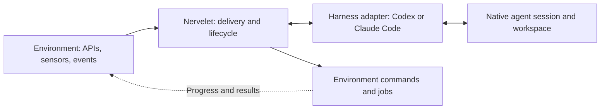

# Nervelet

**A small nervous system for coding agents.**

Nervelet is a library for autonomous coding-agent sessions that receive continuously changing data and pursue a goal. Sources can be robot sensors, simulation state, APIs or event feeds. Commands and local jobs are optional.

**Status:** architecture and implementation specification. Runtime code and adapters are not implemented.

## Architecture

Data acquisition and valid jobs continue while the model thinks. Nervelet delivers bounded, timestamped context at decision boundaries; it does not call the model for every sample.

## Keep it small

- **Core library:** one session supervisor, two integration boundaries: harness and environment.
- **Native harness modules:** preserve sessions, tools, files and compaction; handle each host's quirks explicitly.
- **Compact context:** exact received goal, latest observations, current execution status and unread events.
- **Simple recovery:** restore exact instructions and essential files; refresh observations before new commands.
- **Optional packaging:** plugins expose tools/hooks; Orchflows can launch and assess bounded runs.

DroneRTS is the canonical integration and test case. Its game rules and vehicle fields stay in its environment adapter. An API-only loop needs no robot schema or camera.

## Read

- [Design](DESIGN.md): ownership, interfaces, timing and recovery.
- [Architecture choices and related projects](docs/architecture-options.md): library, plugin, Orchflows and dependency decisions.
- [Codex adapter](docs/harnesses/codex.md) · [Claude Code adapter](docs/harnesses/claude-code.md)
- [DroneRTS integration](docs/dronerts.md)
- [Development instructions](AGENTS.md)

Nervelet: the small connection carrying observations and actions between an agent and its environment.
