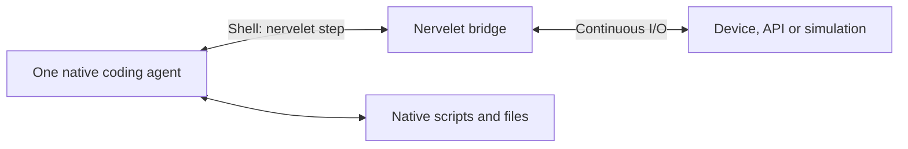

# Nervelet

**A small nervous system for coding agents.**

Connect one Claude Code or Codex agent to continuously changing sensors, APIs or a simulation. The harness runs the agent; Nervelet keeps the connection open and delivers observations and commands.

**Status:** design only. The library, CLI and integrations below are not implemented.

## The small version

- **One persistent bridge** collects data while the model thinks.
- **One step command** observes, waits, or submits compatible commands together.
- **One compact result** contains the exact goal, dated data, own status, running jobs and unread events.
- **Small harness modules** install instructions and recovery hooks. Native sessions, execution and compaction stay native.
- **Plain files** preserve essential instructions and notes across compaction.

Use the native shell tool; no MCP is required. Initial scope is one agent and one bridge. A plugin installer, multiple agents and unattended process supervision can wait.

DroneRTS is the canonical application; its vehicle fields and game rules stay outside the core.

## Read

- [Design](DESIGN.md): the loop, ownership, batches, freshness and recovery.
- [Arduino example](docs/arduino.md): the proposed user experience.
- [Integration decision](docs/architecture-options.md): why a CLI and bridge.
- [Claude Code](docs/harnesses/claude-code.md) · [Codex](docs/harnesses/codex.md)
- [How DroneRTS works today](docs/dronerts.md)
- [Development instructions](AGENTS.md)
