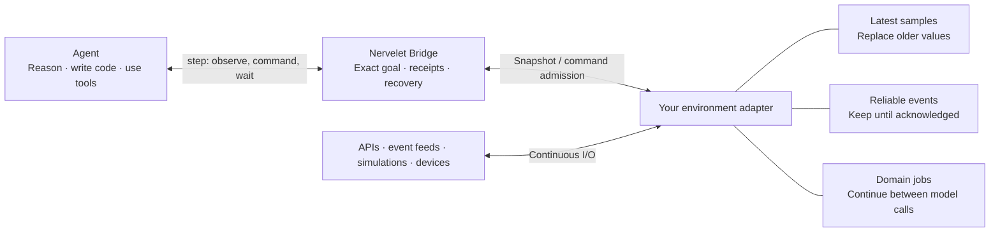
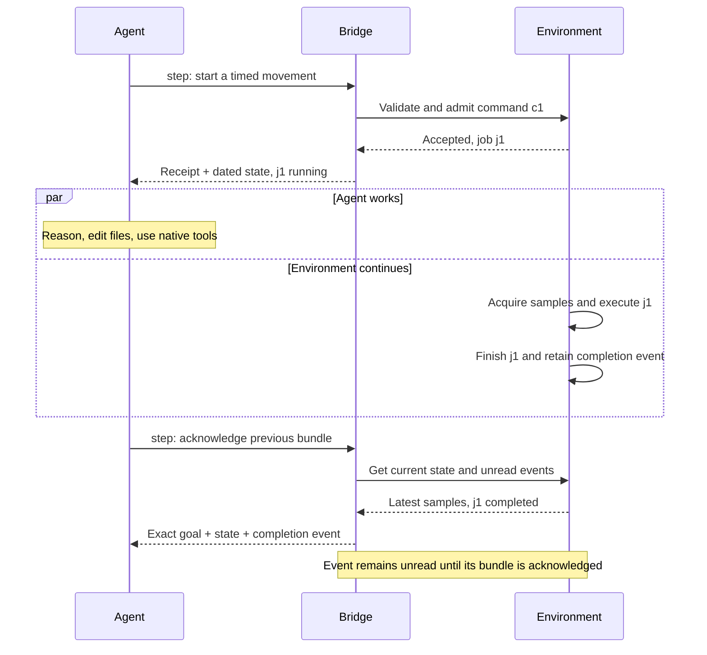
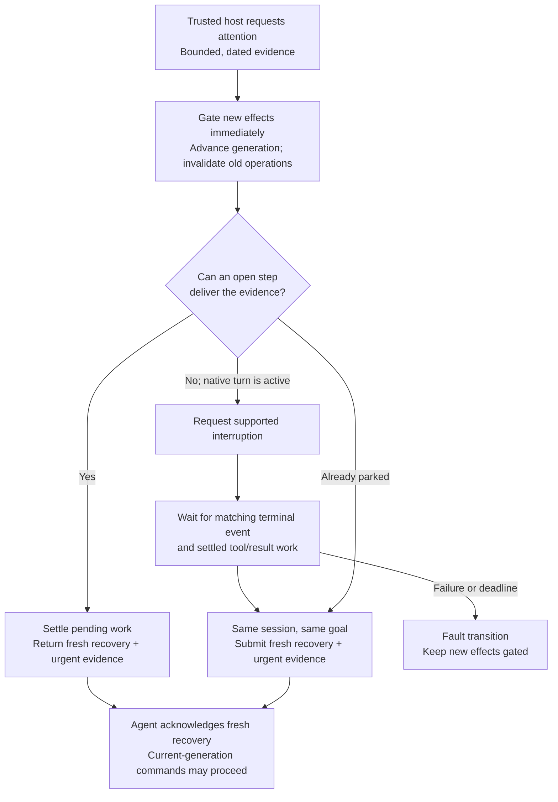

# Nervelet

**The world doesn't pause while your agent thinks.**

A sensor keeps streaming. An API job finishes. A simulated vehicle keeps moving. Meanwhile, your coding agent is reasoning, editing a file, or compacting its conversation.

Nervelet connects that agent to a **continuous environment**. It keeps acquisition and execution independent of inference, then delivers compact, dated observations at explicit tool boundaries.

An embeddable TypeScript library with a local CLI, MCP transport, and native Codex, Claude Code, and API/local-model drivers. One operator per bridge. Your application defines the world.



**[Try it](#try-it-without-a-model)** · **[Embed it](#embed-it-in-your-process)** · **[Driver guide](docs/v2.md)** · **[Tests and limits](docs/validation.md)**

## The interesting part is between tool calls

`accepted` is not `completed`. A new JSON response is not necessarily a new sensor reading. A lost tool result does not mean its command failed.

Nervelet keeps those distinctions explicit:



A fast sensor does not require a fast model loop. Replaceable samples coalesce. Reliable events keep their identity and FIFO order. Managed operators can park until an event, job completion, threshold, or review deadline—without periodic model calls while parked.

## Try it without a model

Requires **Node 24+**. Install from source; this package has not been published to npm.

```sh
git clone https://github.com/DanMcInerney/nervelet.git
cd nervelet
npm ci
npm run build
node dist/cli.js demo
```

In another terminal, from the same checkout:

```sh
node dist/cli.js step
```

You'll get the exact goal, simulated state, dated temperature samples, and startup recovery instructions. Repeat the command to see the environment changing independently. The simulated bench samples every 50 ms; no hardware or inference is involved.

```sh
node dist/cli.js shutdown
```

To attach a signed-in **Claude Code** session, run this from the checkout:

```sh
npm link
cd examples/demo
nervelet init --harness claude-code
nervelet serve
```

Open `claude` in another terminal in that same demo directory, then ask:

> Follow the Nervelet goal. Observe, run the bench commands, and keep checking until the goal is done. Then stop.

The installer adds project instructions and recovery hooks. Native permissions still apply. [Codex setup](docs/harnesses/codex.md) and [managed driver examples](docs/v2.md) cover the other paths; driver qualification varies.

## Embed it in your process

No extra service is required. This example runs from the built checkout using the package's own exports:

```js
import { Bridge } from 'nervelet';
import { createDemoEnvironment } from 'nervelet/demo';

const bridge = new Bridge(createDemoEnvironment(), 'Turn on the bench LED.');
await bridge.start();
try {
  const first = await bridge.step();
  const next = await bridge.step({
    seen: first.id,                    // acknowledge what was received
    goalVersion: first.goal.version,   // act on this exact goal
    commands: [{
      id: first.nextCommandId,
      kind: 'set_led',
      args: { on: true }
    }]
  });
  console.log(next.results);           // [{ id: 'c1', status: 'completed' }]
} finally {
  await bridge.close();
}
```

An agent makes those calls through the CLI, MCP, or `createHandlers(bridge)`. The embedding example makes them directly so you can inspect the contract without a model.

Replace the demo with your own `Environment`: a canonical command profile, continuous acquisition, snapshots, command admission, and cancellation. There are no mandatory camera, pose, cargo, actuator, or simulation-clock fields. An API-only environment is a first-class use case.

| Integration | How it connects |
| --- | --- |
| Existing native session | Shell calls to the CLI; project instructions and recovery hooks |
| Managed Codex / Claude Code | Native session drivers with MCP tools; harness keeps its workspace, tools and compaction |
| API or local model | Explicit endpoint and model; shared handlers, no MCP required |
| Existing application host | Embed the Bridge; retain your actor ownership and process |

Use the optional `Supervisor` when you need a bounded owner for continuation and parking. If your application already owns the actor, keep that owner. The core imports require neither native SDK nor MCP nor serial bindings.

## What the bridge remembers—and what it doesn't guess

| Problem | Contract |
| --- | --- |
| The agent loses context | Repeat the exact goal and compact current state. Recovery adds canonical instructions, active job arguments, and an optional workspace note. Commands wait for recovery acknowledgement. |
| A response gets lost | Redeliver unread events and retained v2 command results with stable identities. `seen` acknowledges only included events and the result revisions actually delivered. |
| A command times out | Retain an uncertain receipt. Reconcile against executor-owned records; never silently replay the effect. |
| Observations get old | Keep acquisition, receipt, and delivery times distinct. Report invalid or missing evidence explicitly. |
| The world is noisy | Bound queues, receipts, payloads, waits, and execution records. Report backpressure instead of silently dropping reliable events. |
| The agent needs to stop | Stop and cancellation bypass ordinary waits and acquisition queues. The environment owns job cancellation and physical control. |

Native file reads and script edits do **not** refresh observations. Ordinary chat does **not** replace the received goal. A bridge restart creates a new epoch: in-memory events and receipts are **not crash-durable**.

## When something cannot wait

Optional **host-authorized emergency attention** lets an application bring urgent evidence to the same agent on the same goal. It is disabled by default; ordinary samples never trigger it.



An interrupt acknowledgement is not proof that the old turn ended. Nervelet joins that turn before replacement, coalesces bursts, and enforces transition, interruption, age, cooldown, and termination bounds. The urgent evidence can bypass a mail backlog **without acknowledging the unseen original event**. Requesting attention does not itself cancel domain jobs.

Native interruption is covered by protocol fixtures; **actual Codex/Claude emergency sessions remain unqualified**. Active-turn emergency interruption is unsupported by the API driver. [Full attention contract and host integration](docs/improvements.md).

## Small enough to inspect

- **Deterministic regression tests** cover the bridge, CLI, serial protocol, MCP, drivers, recovery, receipt/payload retention, waits and six isolated simulated actors. [Current reliability validation](docs/reliability.md) records the actual run count and measurements.
- **About 1.67 MB / six packages** for an isolated core-only installation, excluding Node and optional integrations.
- **64 event encodes instead of 2,080 repeated event visits** in the candidate-packing phase of a 64-event fixture. The final output is still verified; FIFO and acknowledgement semantics stay the same.

Those are measured fixture results, not model-speed or autonomy claims. [Reproduction, measurements, and qualification history](docs/validation.md) include the remaining work: real native interruption, sustained sessions, image understanding, repeated native compaction, and physical hardware. A historical Claude CLI run passed the basic simulated loop; Codex CLI qualification is partial.

```sh
npm test
npm run typecheck
npm run check:docs
npm run check:package
npm run measure:packing
```

These checks require no inference or hardware. Native smoke tests are separate and opt-in.

## Go deeper

- [Embedding, waits, images, drivers and ownership](docs/v2.md)
- [Payload limits, efficient packing and emergency attention](docs/improvements.md)
- [Environment adapter API](docs/api.md)
- [Original design and its tradeoffs](DESIGN.md)
- [Claude Code](docs/harnesses/claude-code.md) · [Codex](docs/harnesses/codex.md) · [Arduino](docs/arduino.md)
- [DroneRTS](docs/dronerts.md): the canonical application embeds one Bridge per pilot; its game rules stay outside the core. Native qualification remains separate.
- [Documentation and evidence index](docs/index.md)
- [Development instructions](AGENTS.md) · [Implementation handoff](NEXT-DESIGN.md)
