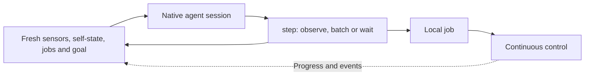

# Nervelet

**A small nervous system for coding agents.**

Nervelet connects native coding agents such as Codex and Claude Code to robots and simulations: fresh observations in, bounded commands out, and continuous local execution between decisions.

**Status:** design and implementation specification. The runtime and adapters are not implemented yet.

## The loop

The world keeps moving while the agent thinks. Nervelet makes observation time, ongoing work and the received goal explicit.

## Small by design

- **One session per robot.** Reuse native tools, files and compaction.
- **Two tools.** `robot.step()` observes, batches compatible commands or waits; `robot.cancel()` interrupts work.
- **Fresh evidence.** Each step returns timestamped sensors, held items, velocity, jobs, messages and the exact received goal.
- **Simple continuity.** Restore operating instructions and refresh state after compaction; preserve scripts and important commitments in private files.
- **Three owners.** The native agent adapter owns its session, the robot adapter owns sensing/control, and the core coordinates delivery and lifecycle.

## Read next

- [Design](DESIGN.md): interfaces, examples, staleness, goal changes, compaction and acceptance criteria.
- [DroneRTS integration](docs/dronerts.md): the originating application, existing behavior and recorded timing evidence.
- [Development instructions](AGENTS.md): scope and implementation constraints.

Nervelet is named for a small nerve: the connection carrying observations and actions between an agent and its environment.
