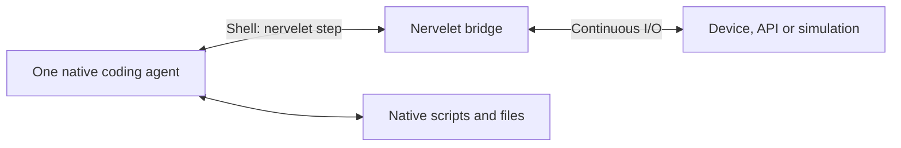

# Nervelet

**A small nervous system for coding agents.**

Connect one Claude Code or Codex agent to continuously changing sensors, APIs or a simulation. The harness runs the agent; Nervelet keeps the connection open and delivers observations and commands.

**v0.1:** TypeScript library, CLI, simulated device, optional serial adapter and native harness installers. [Validation](docs/validation.md) records what has actually been tested.



## The small version

- **One persistent bridge** collects data while the model thinks.
- **One step command** observes, waits, or submits compatible commands together.
- **One compact result** contains the exact goal, dated data, own status, running jobs and unread events.
- **Small harness modules** install instructions and recovery hooks. Native sessions, execution and compaction stay native.
- **Plain files** preserve essential instructions and notes across compaction.

Use the native shell tool; no MCP is required. Initial scope is one agent and one bridge. A plugin installer, multiple agents and unattended process supervision can wait.

DroneRTS is the canonical application; its vehicle fields and game rules stay outside the core.

## Try the simulated bench

Requires Node 24+, Git and an installed, signed-in coding harness. From this checkout:

```sh
npm ci
npm run build
npm link
cd examples/demo
nervelet init --harness claude-code
nervelet serve
```

In another terminal, open the **same directory**, run `claude`, and ask:

> Follow the Nervelet goal. Keep observing with bounded steps until the goal is done, then stop.

The demo samples simulated temperature every 50 ms and supports an LED and timed movement. No hardware is connected. `nervelet demo` also starts this environment without a config file.

For Codex, use `nervelet init --harness codex`, then `codex --enable hooks`. Review project/hook trust and native permissions. [Codex qualification is partial](docs/harnesses/codex.md): startup and observation passed; this Windows host blocked native file writes.

## The step

```sh
nervelet step
nervelet step --seen RECEIVED_BUNDLE_ID --wait-ms 2000
nervelet step --request request.json
nervelet cancel JOB_ID
nervelet goal --file new-goal.txt
nervelet stop
nervelet shutdown
```

Write `request.json` using the **actual** previous bundle ID, goal version and next command ID:

```json
{
  "seen": "RECEIVED_BUNDLE_ID",
  "goalVersion": 1,
  "commands": [
    {"id":"c1","kind":"set_led","args":{"on":true}},
    {"id":"c2","kind":"move","args":{"durationMs":200}}
  ]
}
```

One batch returns individual admissions and one observation. `accepted` means a job started; a later step reports completion. A finished shell call can leave the device moving. Native file tools do not refresh sensors.

## Small, recoverable context

Every step repeats compact current state and the exact goal. Startup/resume/compaction hooks require a fresh observation. That recovery bundle adds the exact operating profile, active job arguments and optional `working.md` note. Acknowledging its ID enables commands. Old sensor positions never become durable facts.

Nervelet uses the harness's existing session, workspace and compaction. It does not schedule model calls or promise unattended restart. Bridge restarts create a new epoch; in-memory events and receipts are not persisted.

## Build an integration

- [Design](DESIGN.md): the loop, ownership, batches, freshness and recovery.
- [Adapter API](docs/api.md): configuration, embedding and ownership.
- [Arduino example](docs/arduino.md): firmware, serial setup and protocol.
- [Integration decision](docs/architecture-options.md): why a CLI and bridge.
- [Claude Code](docs/harnesses/claude-code.md) · [Codex](docs/harnesses/codex.md)
- [How DroneRTS works today](docs/dronerts.md)
- [Development instructions](AGENTS.md)

DroneRTS integration, image transport and additional agents are deferred. This repository has not been published to npm; install from a built local checkout for a separate project.

## Check

```sh
npm test
```

Builds and runs deterministic bridge, CLI, hook and serial protocol tests. Native inference tests are explicit opt-in commands described in [validation](docs/validation.md).
