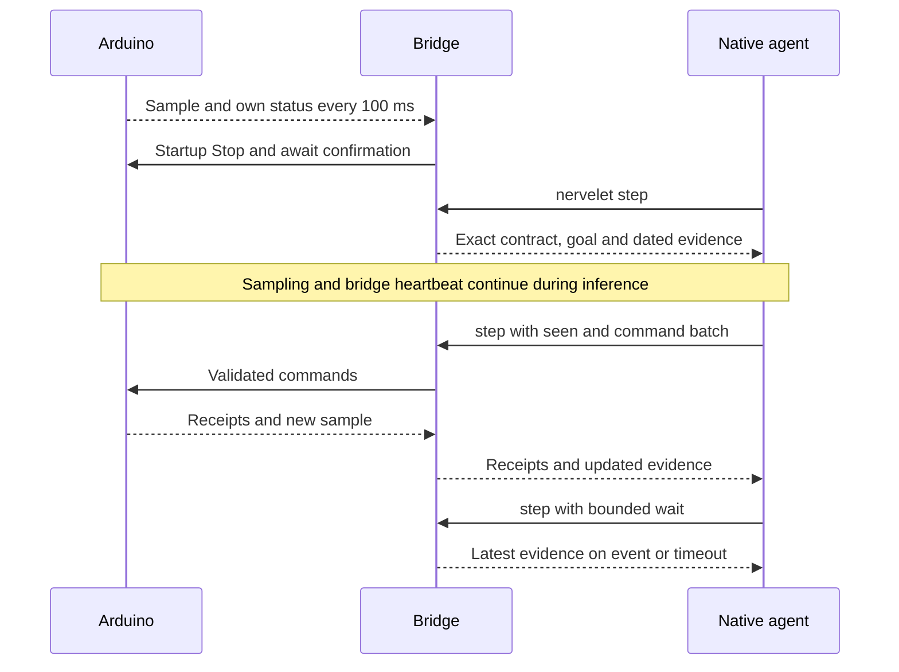

# One Arduino, one native agent

Claude Code/Codex and Nervelet run on the computer. The Arduino samples its sensors, reports status and accepts bounded commands. The model does not run on the microcontroller.

The [example](../examples/arduino/nervelet.config.ts) targets an **Uno R3**, a TMP36 temperature sensor on A0, 5 V analog reference and the onboard LED on pin 13. Its firmware compiles; physical hardware has not been tested. The LED is a harmless first output, not a motor controller.

## Setup

1. Build/link Nervelet following the [README](../README.md).
2. Connect the TMP36 using its manufacturer's pinout: supply, ground, output to A0. The profile's conversion assumes a 5 V ADC reference; change firmware and profile together for another board/reference.
3. Install ArduinoJson 7 and compile/upload [bench.ino](../examples/arduino/bench/bench.ino) using Arduino IDE or CLI. Uploading is a separate, explicit operation. Stop any other serial monitor before starting Nervelet.
4. From `examples/arduino`, select the serial port, install harness instructions and start the bridge.

PowerShell example:

```powershell
$env:NERVELET_PORT = 'COM4'
nervelet init --harness claude-code
nervelet serve
```

On macOS/Linux, use your actual device path, for example `NERVELET_PORT=/dev/ttyACM0 nervelet serve`. In another terminal, run `claude` in the same directory and ask it to follow the Nervelet goal. Native tool permissions still apply.

Optional CLI compilation, from the repository root:

```sh
arduino-cli core install arduino:avr
arduino-cli lib install ArduinoJson
arduino-cli compile --fqbn arduino:avr:uno examples/arduino/bench
```

## What keeps running



The agent sees `state.value.ledOutput` and `samples.temperatureC`. Each includes `acquired`, `receivedMs` and `valid`. LED output is the commanded output setting, not measured brightness. Board acquisition time and bridge receipt time use different clocks.

The bridge sends heartbeat every 250 ms, independent of inference. Firmware clears the LED after 1.5 s without heartbeat. Missing telemetry faults the adapter after its configured 2 s freshness bound (checked every 250 ms); malformed/invalid telemetry faults immediately. Faults gate commands and trigger a best-effort Stop. Device watchdog remains the final path if the bridge disconnects. New telemetry does not silently clear an existing fault.

`nervelet stop` clears the LED and ends the loop. `shutdown` also closes the port. Closing the model alone leaves the bridge running; it is not a device Stop. Restart the bridge only after reconciling a fault; it obtains a confirmed Stop on startup.

## Serial protocol v1

One JSON object per line, UTF-8, 115200 baud. These packets are wire-format examples, not full model bundles.

Device → bridge:

```json
{"type":"sample","clock":"board","seq":1,"atMs":100,"valid":true,"state":{"ledOutput":false},"samples":{"temperatureC":23.1}}
{"type":"receipt","id":"EPOCH:c1","status":"completed"}
{"type":"receipt","id":"EPOCH:c2","status":"accepted","jobId":"j1"}
{"type":"job","id":"j1","status":"completed"}
{"type":"event","kind":"message","data":{"text":"button pressed"}}
{"type":"control","id":"CONTROL_ID","ok":true}
```

Bridge → device:

```json
{"type":"command","id":"EPOCH:c1","kind":"set_led","args":{"on":true}}
{"type":"command","id":"EPOCH:c2","kind":"sample","args":{}}
{"type":"heartbeat"}
{"type":"cancel","id":"CONTROL_ID","jobId":"j1"}
{"type":"stop","id":"CONTROL_ID"}
```

Echo request IDs exactly. Admission statuses are `accepted`, `completed`, `rejected`; rejected receipts may include `reason`. Only accepted commands create jobs. Report later job status as `running`, `blocked`, `completed`, `cancelled` or `failed`. Reuse neither job IDs nor source sequence numbers during a connection. A changed source clock or non-increasing sequence faults the bridge. The example firmware supports immediate LED/sample commands; Stop and cancel both clear its LED. It has no movement or job implementation.

Adapter input frames are capped at 8 KiB; the Uno example's command buffer is **384 bytes**, sufficient for its tiny command schema. Pending requests and retained job records are capped at 16 each. Unread event overflow faults explicitly. This simple wire protocol has no reliable device-event replay or automatic reconnect; add source-specific reliability in another adapter when needed.

Implementation uses optional [Node SerialPort](https://serialport.io/docs/). See [validation](validation.md) for exact compiler/core/library versions and the difference between stream tests and hardware evidence.
