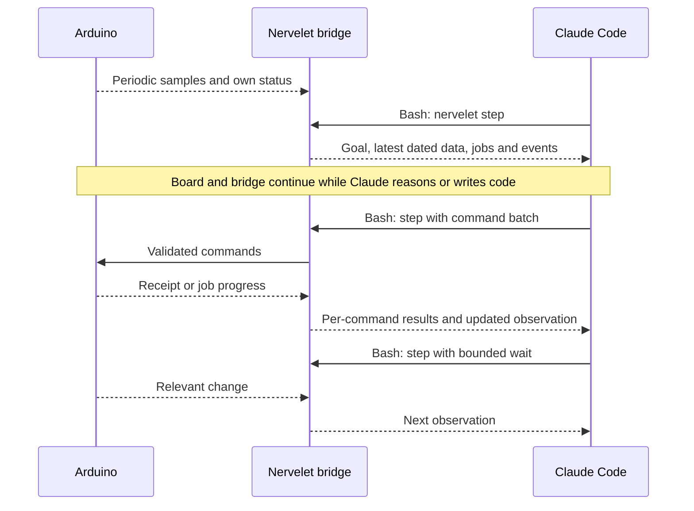

# One Arduino, one Claude Code agent

**Proposed experience. These commands, adapters and example firmware are not implemented yet.**

Claude Code and Nervelet run on the connected computer. The Arduino runs firmware that samples sensors, reports device status and accepts bounded commands. The model does not run on the microcontroller.

## Setup

1. Provide firmware and an adapter profile describing the serial protocol, units, sensor validity and allowed commands. For a first example, use a temperature sensor and an LED.
2. Configure the port and baud rate in `nervelet.config.ts`; write the exact objective in `goal.txt`.
3. Start the bridge and open the native agent.

Proposed terminal commands:

```sh
nervelet init --harness claude-code
nervelet serve --config nervelet.config.ts --goal goal.txt
```

In another terminal, run `claude` in the same project and ask it to follow the configured Nervelet goal. `init` would install project instructions/hooks; `serve` would keep the device connection open. Firmware flashing is a separate setup action, not an implicit side effect of either command.

The serial adapter can use [Node SerialPort](https://serialport.io/docs/). A small newline-delimited JSON protocol is enough for this example; other adapters can use existing binary protocols or APIs. Core does not require a particular wire format.

## What happens



The agent can write a helper script with native tools, test it, then run it through the same bridge client. A helper must not independently open the serial port or acknowledge model inbox data it has not delivered. Deterministic sampling or fast control should execute locally; the model chooses and inspects work at a slower pace.

## What the agent sees

Illustrative compact JSON, formatted here for readability:

```json
{
  "id": "b41",
  "epoch": "host:4",
  "deliveredMs": 31258,
  "profile": "bench:1",
  "loop": "active",
  "rule": "Step refreshes observations; native file tools do not. Observation times are acquisition times. Accepted jobs may still run. Wait when idle; stop ends the loop.",
  "goal": { "version": 3, "status": "active", "text": "Watch temperature until stopped." },
  "source": {
    "id": "serial",
    "epoch": "board:9",
    "sampleMs": 512,
    "receivedMs": 31250,
    "valid": true
  },
  "state": { "ledOutput": false },
  "samples": { "temperatureC": 24.6 }
}
```

Here, the single source timestamp applies to both state and samples. Board acquisition time and host receipt time use different clocks; do not subtract them without synchronization. Empty jobs/events/results are omitted. A disconnected board instead reports stale/invalid data explicitly.

The next call can be `nervelet step --seen b41 --wait-ms 2000`. Waiting yields on a relevant event or timeout; it does not suspend acquisition. The response arrives as ordinary Bash output in the same Claude conversation.

For an adapter with motion, a result might additionally contain `velocity` and a job such as `{ "id": "j7", "status": "running" }`. That tells the agent the device is still moving even though command submission returned earlier.

## Compaction and stopping

Keep the exact profile and goal outside conversation history. Restore instructions through the harness module, reacquire data and require a fresh acknowledged bundle before new commands. Keep only important intentions in a short native workspace note.

`nervelet stop` ends the loop and invokes the adapter's cancellation policy. Closing or interrupting Claude is a separate event; the device adapter must define controller-loss behavior. Initial support assumes an open native session and respects its limits. Automatic process restart and additional agents are deferred.
