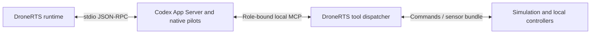

# DroneRTS integration

The design originated in [DroneRTS](https://github.com/DanMcInerney/DroneRTS), a continuous drone simulation. DroneRTS is the canonical future application; its rules remain application-specific. This document records the extraction context as of 2026-09-15. The standalone runtime is implemented; its DroneRTS integration is deferred.

## Boundary

| Standalone library | DroneRTS environment/application |
| --- | --- |
| Native recovery integration | Existing native Codex pilots and their configured model |
| Versioned received goal and delivery boundary | Actual per-drone instruction receipt and match lifecycle |
| Compact observation envelope | Own pixels, telemetry, equipment, cargo, jobs and inbox |
| Batch admission contract | Existing compatible commands and one movement writer |
| Job/source references | Local controller, ordered routes and bounded QuickJS routines |
| Workspace integration | Existing private atomic files and storage quotas |

Keep the simulation and its rules in DroneRTS. The library does not acquire battlefield geometry, opponent telemetry, hidden locators, automatic classifiers or global pathfinding.

The environment combines DroneRTS sensor acquisition, native radio events and existing command/job interfaces. Its state schema owns pose, velocity, held equipment and cargo. Its source profile requires fresh camera acquisition at model-facing steps; the generic library permits environments with no images. Existing `observe`, `wait` and `exchange` names can remain application aliases for the shared step contract.

DroneRTS retains actor creation and session control. The eventual embedded [Codex integration](harnesses/codex.md) translates recovery boundaries for those actors. The initial single-agent CLI does not replace the fleet. Do not move game-specific launch gating or tactical coordination into the harness module.

## Existing behavior

The current transport is MCP. DroneRTS launches `codex app-server --stdio` and controls native sessions over JSON-RPC. Each pilot receives a role-bound local MCP endpoint; tool calls dispatch to the simulation, whose result includes the observation bundle. Codex owns the reasoning/tool loop. The simulation and local controllers continue independently of inference.

The native MCP server is a transport, not the component that makes the loop autonomous. Source: [App Server process](https://github.com/DanMcInerney/DroneRTS/blob/main/server/runtime-rpc.ts), [MCP dispatcher](https://github.com/DanMcInerney/DroneRTS/blob/main/server/runtime-mcp.ts). This description was checked against the local source; remote files may reflect a different revision.

Normal living-pilot direct tool results and aggregate `exchange` results attempt a fresh camera acquisition and return timestamped self-state, equipment, cargo, velocity, jobs, routines and unread messages. Capture failure is explicit. Internal controller telemetry does not acquire a new image; routine camera reads use the latest model-acquired frame.

`exchange` admits up to eight compatible operations with individual outcomes. Admission is separate from physical completion. Local control continues while the agent thinks or waits.

The runtime observes native compaction events. Connecting those events to Nervelet's recovery gate remains integration work.

Source references: [tools and instructions](https://github.com/DanMcInerney/DroneRTS/blob/main/server/runtime-tools.ts), [bundle assembly](https://github.com/DanMcInerney/DroneRTS/blob/main/server/game.ts), [native runtime](https://github.com/DanMcInerney/DroneRTS/blob/main/server/runtime.ts), [onboard contract](https://github.com/DanMcInerney/DroneRTS/blob/main/ONBOARD.md). These links require access to the source repository.

## Preserve during integration

- Preserve actual delivered observations and messages, isolated robot workspaces, existing quotas and capability restrictions.
- Preserve one movement writer, explicit replacement, local controller leases and prompt cancellation.
- Expose no additional host shell, filesystem, network, geometry or perception capability through the adapter.
- Retain authoritative goal text only after actual per-drone delivery; ordinary chat does not replace it.
- Keep game economics, geometry, radio transport and tactical decisions outside the general core.
- Verify native child behavior explicitly; root-session hooks do not establish child-session support.

## Recorded timing evidence

Historical trial `2026-09-15T02-27-58-524Z-focused-haul-single-0567e7f0`, source manifest `2bf300245ad0a486afabb22833533d1896a2d699433e8733135e7baa638b5093`:

| Measurement | Recorded value |
| --- | --- |
| Delivered salvage | 60 |
| Delivery simulation time | 181.102 s |
| Completed-tool-to-next-call gap, median | 5.177 s |
| Completed-tool-to-next-call gap, maximum | 26.502 s |
| Compactions | 0 |

Most of the reported decision delay was stationary. This is evidence about that source revision's logistics trial, not moving-target performance or validation of the standalone library.

Source: [QA investigation, first fresh single haul](https://github.com/DanMcInerney/DroneRTS/blob/main/QA-INVESTIGATION-2026-09-15.md#first-fresh-single-haul-passed). Historical rules and results retain their original meaning.

## Integration sequence

1. Implement and test the [single-agent CLI contract](../DESIGN.md) with a fake environment, Claude Code, serial support and Codex.
2. Separately qualify the existing DroneRTS actor lifecycle and observation transport for an embedded integration.
3. Map existing DroneRTS tools and data sources through the environment boundary without changing simulation behavior. Keep its current MCP bridge until a replacement preserves isolation and same-result images; enabling a host shell is not a drop-in substitute.
4. Prove existing control, conservation, isolation and cancellation checks still pass.
5. Run bounded real-agent trials before making claims about recovered understanding or autonomous progress.
