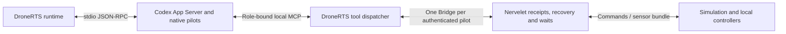

# DroneRTS integration

**Implemented application integration:** DroneRTS embeds one borrowed Nervelet Bridge per authenticated pilot in its existing Node process. It retains its native actor owner, role-bound MCP transport, simulation, sensors, local controllers, workspace and fixed quotas. The [application contract](https://github.com/DanMcInerney/DroneRTS/blob/main/NERVELET-INTEGRATION.md) and [reliability record](https://github.com/DanMcInerney/DroneRTS/blob/main/RELIABILITY-QA.md) identify the exact dependency pin and application checks; an unmerged implementation requires its documented local source clone. Remote main may not yet contain the reviewed implementation.

The design originated in [DroneRTS](https://github.com/DanMcInerney/DroneRTS), the canonical application. Its game rules remain application-specific. The separate [six-pilot library fixture](../examples/dronerts/pilots.ts) verifies borrowed lifetimes, isolated goals/mail/images, quotas, one writer and independent control during blocked capture; it does not itself run the game or qualify native image delivery. The extraction context dates to 2026-09-15; current integration behavior follows below.

## Boundary

| Standalone library | DroneRTS environment/application |
| --- | --- |
| Native recovery integration | Existing native Codex pilots and their configured model |
| Versioned received goal and delivery boundary | Actual per-drone instruction receipt and match lifecycle |
| Compact observation envelope | Own pixels, telemetry, equipment, cargo, jobs and inbox |
| Batch admission contract | Existing compatible commands and one movement writer |
| Job/source references | Local controller, ordered routes and bounded QuickJS routines |
| Workspace integration | Existing private atomic files and storage quotas |

Keep the simulation and its rules in DroneRTS. The library does not acquire battlefield geometry, opponent telemetry, hidden locators, automatic classifiers or global pathfinding.

The environment combines DroneRTS sensor acquisition, native radio events and existing command/job interfaces. Its state schema owns pose, velocity, held equipment and cargo. Its source profile requires fresh camera acquisition at model-facing steps; the generic library permits environments with no images. Existing `observe`, `wait` and `exchange` names can remain application aliases for the shared step contract.

DroneRTS retains actor creation and session control. Its native runtime translates correlated compaction/recovery boundaries into Bridge recovery; it does not add the library's managed Supervisor. The initial single-agent CLI does not replace the fleet. Game-specific launch gating and tactical coordination remain outside the harness module.

## Existing behavior

The current transport is MCP. DroneRTS launches `codex app-server --stdio` and controls native sessions over JSON-RPC. Each pilot receives a role-bound local MCP endpoint; tool calls dispatch to the simulation, whose result includes the observation bundle. Codex owns the reasoning/tool loop. The simulation and local controllers continue independently of inference.

The native MCP server is a transport, not the component that makes the loop autonomous. Source: [App Server process](https://github.com/DanMcInerney/DroneRTS/blob/main/server/runtime-rpc.ts), [MCP dispatcher](https://github.com/DanMcInerney/DroneRTS/blob/main/server/runtime-mcp.ts). This description was checked against the local source; remote files may reflect a different revision.

Normal living-pilot direct tool results and aggregate `exchange` results attempt a fresh camera acquisition and return timestamped self-state, equipment, cargo, velocity, jobs, routines and unread messages. Capture failure is explicit. Internal controller telemetry does not acquire a new image; routine camera reads use the latest model-acquired frame.

`exchange` admits up to eight compatible operations with individual outcomes. Admission is separate from physical completion. Local control continues while the agent thinks or waits.

Only an echoed `seen` consumes included mail and the exact delivered result revision. Successful final transport submission counts for launch gating but does not acknowledge model receipt. Original operation output lives in `nervelet.results[].data = {result, isError}`; observation state remains current telemetry. The adapter retains the original executor result through failed capture, formatting or submission, shares its immutable payload with core, and reconciles uncertainty without replay. Camera redelivery never substitutes an old capture for new evidence.

Omitted-`until` waits select v2 `anyEvent`, including assembled-but-unacknowledged mail. Scoped `onboard-change` notifications wake affected pilots; explicit lifecycle/connection signals preserve Stop, reset, session replacement, destruction and disconnect behavior. Only numeric conditions require continuous tick evaluations. Stable current-ruleset tool advertisement is separate from dynamic `availableTools` and effect admission. The adapter uses the checked `immutableProfile` path.

Each pilot's existing 384 KiB diagnostics/cache reservation bounds result payloads and protocol metadata; fixed application partitions and 64 KiB workspace files remain unchanged. The application contract records deterministic preflight/backpressure and conservative retained versus escaped-wire accounting. Equipment changes no longer force native catalog-yield turns; actor retirement, exact turn ownership, ordinary continuation and emergency settlement retain their separate responsibilities.

Source references: [tools and instructions](https://github.com/DanMcInerney/DroneRTS/blob/main/server/runtime-tools.ts), [bundle assembly](https://github.com/DanMcInerney/DroneRTS/blob/main/server/game.ts), [native runtime](https://github.com/DanMcInerney/DroneRTS/blob/main/server/runtime.ts), [onboard contract](https://github.com/DanMcInerney/DroneRTS/blob/main/ONBOARD.md). These links require access to the source repository.

## Preserve during integration

- Preserve actual delivered observations and messages, isolated robot workspaces, existing quotas and capability restrictions.
- Preserve one movement writer, explicit replacement, local controller leases and prompt cancellation.
- Expose no additional host shell, filesystem, network, geometry or perception capability through the adapter.
- Retain authoritative goal text only after actual per-drone delivery; ordinary chat does not replace it.
- Keep game economics, geometry, radio transport and tactical decisions outside the general core.
- Verify native child behavior explicitly; root-session hooks do not establish child-session support.

## Recorded timing evidence

Historical trial `2026-09-15T02-27-58-524Z-focused-haul-single-0567e7f0`, source manifest `2bf300245ad0a486afabb22833533d1896a2d699433e8733135e7baa638b5093`:

| Measurement | Recorded value |
| --- | --- |
| Delivered salvage | 60 |
| Delivery simulation time | 181.102 s |
| Completed-tool-to-next-call gap, median | 5.177 s |
| Completed-tool-to-next-call gap, maximum | 26.502 s |
| Compactions | 0 |

Most of the reported decision delay was stationary. This is evidence about that source revision's logistics trial, not moving-target performance or validation of the standalone library.

Source: [QA investigation, first fresh single haul](https://github.com/DanMcInerney/DroneRTS/blob/main/QA-INVESTIGATION-2026-09-15.md#first-fresh-single-haul-passed). Historical rules and results retain their original meaning.

## Qualification boundaries

The library's deterministic tests, the application's transport/quota/isolation tests, and real native trials are distinct evidence. [Camera-age QA](https://github.com/DanMcInerney/DroneRTS/blob/main/CAMERA-AGE-POLICY-QA.md) records one successful native reasoning-interruption path and an unresolved held-wait camera acquisition failure. The reliability implementation adds deterministic checks without inference, matches, browsers or hardware; it does not resolve that native gate.

Attention and acoustic sensing remain independently opt-in and off by default. Repeated real compaction, sustained camera availability, image understanding and useful autonomous performance require separately authorized, source-recorded qualification. The historical timing measurements above retain their original meaning.
