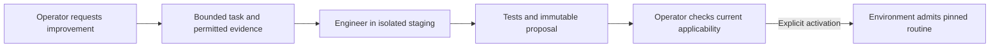

# Optional bounded engineer

**Disabled by default.** This extension follows single-operator qualification. [Handoff](../../NEXT-DESIGN.md) · [Contract](CONTRACT.md)

Use one finite helper when repeated operator work could become a tested routine. It proposes artifacts; the operator and environment retain decision and execution authority.

Example: the operator supplies noisy distance traces and asks for a filter. The helper returns code, tests, assumptions and a hash. The operator checks the current sensor profile, then requests a new routine version. Existing motion does not change because a file was edited.

Requirements:

- One finite task; limits on wall time, model use, CPU, storage, processes and output. No recursive delegation. Parent shutdown cancels it; relevant goal/profile changes invalidate its proposal.
- Only supplied evidence and permitted code. No device handles, actuator credentials, goal changes, operator inbox acknowledgements or policy edits.
- Enforced isolation. Hiding a tool while leaving shell access to the device is insufficient. Disable the extension when the driver cannot enforce its boundaries.
- A bounded result containing goal/profile version, evidence references, artifact hash, tests and assumptions. Deliver it as an ordinary event; never auto-import or execute it.
- Operator chooses activation; the environment validates, pins the version and applies ordinary resource/cancellation checks. No hot patching active jobs. Rollback is explicit.

Use a native background agent only when these limits can be enforced; otherwise use a separate bounded driver invocation. This is an optional proposal worker, not a second operator or mandatory information curator.

Recorded tests can validate a parser against supplied traces. They cannot prove how a changed physical controller behaves after its trajectory diverges. Measure benefit including shared CPU/inference contention and total cost. Keep the extension off for DroneRTS’s canonical six-pilot experiment unless a separate variant is authorized.
