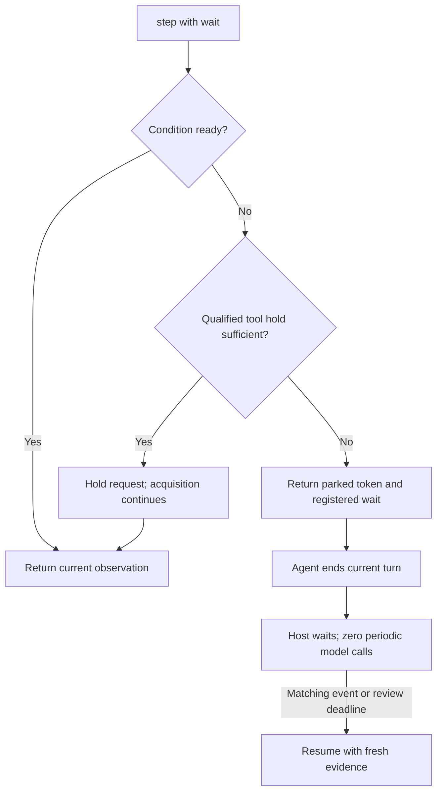

# Nervelet loop contract

**Implementation status:** v0.2 implements the required core/driver phases. The normative text below remains the design contract; [implementation limits](../v2.md) and [qualification evidence](../validation.md) describe what is actually present and tested. Optional extensions are not implemented.

**Proposed vNext · 2026-09-15.** Normative design; TypeScript v0.1 does not implement this contract. Start with [the handoff](../../NEXT-DESIGN.md). The reference implementation remains TypeScript/Node and evolves the existing Bridge. New wire examples use protocol version 2 and camelCase; the unimplemented snake_case proposal is superseded. Pin these schemas and the thin v0.1 compatibility mapping before implementation.

## 1. One owner per concept

| Owner | Responsibility |
| --- | --- |
| Application | Authorized goal sources, permissions, completion checks, budgets and domain policy |
| Environment | Acquisition, latest samples, reliable domain events, state, command definitions, job execution and physical stop |
| Core | Received goal, lifecycle, observation acknowledgements, command receipts, recovery generations and logical waits |
| Supervisor | One active operator turn, event-driven continuation, bounded retries and driver lifecycle |
| Driver | Native session integration or direct API conversation; transport and capability differences |

The supervisor is deterministic library code. An existing actor host may supply it. Never run two supervisors for the same operator. Native harnesses retain reasoning, workspaces, ordinary tools and compaction. The environment remains alive while inference runs or is parked.

Use one environment adapter, which may compose sources. Its protocol covers start/close, cheap snapshot, optional bounded media capture, change notifications, event peek/ack, admit/cancel/stop and a versioned profile. Core owns delivery bookkeeping, not a duplicate domain inbox. Supply defaults for environments without media or long jobs.

## 2. Tools and identity

| Tool | Meaning |
| --- | --- |
| `step(seen?, goalVersion?, commands=[], wait?, checkpoint?)` | Acknowledge evidence, admit a compatible batch, optionally wait, then return current evidence |
| `cancel(jobId)` | Request cancellation independently of a pending step |
| `stop()` | Gate effects and continuation immediately; invoke domain stop and report its actual outcome |
| `describe(topic)` | Read bounded schemas, profile details or artifacts |

Every wire request carries `loopRef`, or an equivalent authenticated scoped handle. The driver injects it when supported; otherwise the model echoes it. Trusted caller binding determines authorization: a supplied loop ID never grants access. Do not infer identity from the latest session, working directory or transport connection.

A host may withhold `stop` or goal tools from the agent while retaining its own control API. Generate the minimum instructions from the exposed surface; the examples here use the default general tool set.

Goals normally enter through the application. Optional `setGoal(expectedVersion, text)` requires explicit application delegation; attached mode grants no such permission by itself. Ordinary messages and sensor text cannot change goals. An injected goal provider supplies the exact received record and version; the standalone provider may own a local goal file. Do not increment a second version in an embedding host. Delivery to the authorized receiver determines when a new goal takes effect. Replacing a goal quiesces affected work without terminating the loop. A missing goal permits observation but gates goal-dependent effects. A final answer alone does not prove goal completion.

One registry defines commands, argument schemas, resource claims and descriptions. Generate schemas and instructions from it. Availability belongs in current state. Profile/schema changes require recovery and, if necessary, a qualified catalog refresh or session transition.

## 3. Batches, jobs and uncertainty

```json
{"schemaVersion":2,"loopRef":"bench:e3","seen":"b41","goalVersion":7,"commands":[{"id":"c12","kind":"move","args":{"route":"r2"}},{"id":"c13","kind":"send_message","args":{"text":"Moving now."}}]}
```

Admit compatible commands in order, with one receipt per command. Default maximum: eight. Without an explicit wait, step returns after admission; accepted jobs may overlap. Reject conflicting writers. No transaction or rollback is promised. Report skipped/not-admitted entries if processing stops early.

Validate the complete request, including wait syntax, before effects. When commands and a wait share a step, register against the change sequence before admission so fast completion cannot be missed. A rejected or uncertain admission returns promptly instead of hiding behind a long wait.

`accepted` means admitted, not physically completed. Job states distinguish pending/running/stopping from completed/blocked/cancelled/failed. Receipts distinguish rejected, accepted, completed and unknown effects. A timeout, disconnect or aborted asynchronous operation does not prove an effect never happened.

Only one ordinary step may run per operator. Concurrent calls receive `busy` without effects; native parallel calls are not implicitly a batch. Cancellation and stop bypass this lane. API drivers return a paired result for every declared tool-call ID, including rejected calls.

Command IDs are stable and scoped to the epoch. Return known receipts on retries; reject mismatched payload reuse. After receipt retention expires, refuse old IDs instead of re-executing them. Reconcile uncertain effects with the authoritative executor; keep affected resources gated meanwhile. Persisted receipts alone do not create exactly-once physical execution.

**Ordered work:** “move, then load, then return” requires an environment job. Supply an optional reusable `sequence` helper in the environment utilities: bounded linear children, normal admission and precondition checks per child, await actual completion, abort on first non-success, propagate cancellation. No branching language or second core scheduler. Parent/child IDs and resource ownership must be unambiguous; restart never blindly replays a child.

Optional `run_routine(name, version, args)` is an environment command backed by immutable artifacts. Scripts use the same admission/controller path. Native shell access must not provide another actuator writer. Editing a file does not change a running routine.

## 4. Observations and freshness

Every observation repeats the short exact goal, minimum rules, current state, active jobs, dated inputs, receipts and included events. Omit unsupported fields; inventory, pose and camera are application schemas.

```json
{
  "schemaVersion":2,"loopRef":"bench:e3","id":"b42","generation":2,"assembledMs":12520,
  "profile":"bench:2","loop":"active",
  "rule":"Echo seen and goalVersion. Accepted is not done. Inputs age while you think. step refreshes; other tools do not. When parked, end this turn. stop ends the loop.",
  "goal":{"version":7,"text":"Carry the sample to the marked tray."},
  "nextCommandId":"c14",
  "state":{"ageMs":15,"valid":true,"value":{"velocity":[0.3,0,0],"held":["sample"]}},
  "jobs":[{"id":"j9","kind":"move","status":"running","commandId":"c12","target":"r2"}],
  "results":[{"id":"c12","status":"accepted","jobId":"j9"},{"id":"c13","status":"completed"}],
  "camera":{"frame":"f8","ageMs":90,"valid":true,"reused":false},
  "events":[{"id":"m6","kind":"message","text":"Tray ready.","redelivered":true}],
  "hasMore":false
}
```

`assembledMs` is assembly time in the epoch's monotonic clock, not model receipt. Profiles define units, axes and clock mappings. Preserve source acquisition and host receipt times; compact ages are allowed when the mapping is known. Unknown timestamps remain unknown. Trace acquisition, assembly, submission and acknowledgement separately.

Pixels accompany metadata as a real image attachment. A filename is not visual input. Drivers use supported multimodal representations; some providers need an observation message following paired tool results. Never silently discard unsupported images.

Camera policy is `none`, age-limited `latest`, or `capture_on_step`. Sensor ticks do not each require a model image. DroneRTS retains capture at its model-facing boundaries. Capture once during final assembly, then read current state/jobs; never drain inboxes or capture repeatedly during preflight. Samples need not be simultaneous. Mark missing, reused, stale or invalid values.

A running job and measured velocity explain continued movement. Completed tools do not prove arrival. Known native task status stays separate from domain jobs. Only `step` guarantees new observations by default; applications may preserve stronger direct-tool behavior. Private reasoning and arbitrary file tools are not sensor injection boundaries.

Old enemy positions remain dated observations or hypotheses. Check command-specific freshness and preconditions against permitted current evidence at admission and the final side-effect boundary. A recent `seen` alone does not prove fresh sensing. The core adds no classifier, navigation policy or hidden world model.

## 5. Wait without idle inference

```json
{"schemaVersion":2,"loopRef":"bench:e3","seen":"b42","goalVersion":7,"wait":{"until":[{"kind":"jobTerminal","id":"j9"},{"kind":"event","type":"message"}],"reviewMs":600000}}
```

`reviewMs` bounds logical silence, independently of the driver's tool hold limit. Applications may require a finite review deadline; an API monitor may permit none. Reconnects and intermediate transport operations never extend it silently.

Use a small declarative OR-list: reliable event type, job terminal, named valid-field threshold or change beyond a deadband. Restrict fields, operators and size through the profile. No arbitrary code or LLM filtering. Coalesce replaceable samples. Goal changes, stop and relevant faults bypass filters. Stale/invalid inputs cannot satisfy numeric predicates as fresh data.

Register and check against a monotonic change sequence to avoid losing an event between snapshot and wait. One pending wait per operator suffices. Unacknowledged events remain available; already delivered events do not repeatedly trigger the same wait. Wait generations invalidate stale callbacks after cancellation or goal replacement.

Managed drivers use qualified long tool holds or **parking**:



Parking can cost one closing native model response after the tool result. A direct API driver can park between model requests without that closing response. Neither path costs another response every transport timeout. The response includes admissions/current evidence and `wait: {status: "parked", token: "..."}`. The loop remains active; parking does not mean the device stopped. Ignoring parking becomes a bounded continuation fault, never an infinite corrective-prompt loop. Another ordinary step explicitly supersedes the wait, subject to the per-wake budget.

An event during the closing response is latched; wake once after the turn finishes. Never overlap operator turns. Coalesce further events and assemble current evidence at delivery. Unexpected final answers use bounded continuation; they do not imply mission completion.

Attached sessions cannot promise host-owned parking without a qualified native wake path. Declare hold limits and idle-wake behavior. Repeated short waits may be an attached limitation; they are not a cost-free substitute for managed parking.

## 6. Compaction, delivery and restart

| Exact record | Owner | Delivery |
| --- | --- | --- |
| Minimum rules and received goal/version | Core | Every observation |
| Required profile, calibration, limits and command definitions | Environment | Startup/recovery/profile change; details on demand |
| Current state, jobs, input ages | Environment | Every observation |
| Active job arguments and pinned routine identity | Environment | Recovery; compact intent normally |
| Delivery cursors, receipts and unresolved effects | Core | Actionable status only |
| Agent checkpoint and authored files | Plain private files | Small checkpoint on recovery; other files on request |

Authoritative records live outside summarized conversation. A checkpoint is optional, bounded, atomically stored agent text; it cannot rewrite goals or turn stale guesses into facts. No memory service or summarizer is required.

On known context loss, advance the recovery generation and gate new effects. Return exact required records plus fresh evidence. Acknowledging a bundle from the current generation, epoch and goal enables admission; acknowledgement is not proof of understanding. Existing jobs follow domain policy. If compaction cannot be detected, repeat all required operational instructions at every boundary and declare the cost/limitation. A hash alone is insufficient.

API drivers rotate bounded history containing complete exchanges and inject recovery records. Native drivers let the harness compact. Stable trusted prefixes and deterministic schema ordering help caching; volatile evidence follows them. Cache behavior is provider-specific. Never sacrifice tool pairing or current evidence for cache hits.

Use latest-value slots for samples and a bounded reliable event queue. Peek before assembly; consume only events covered by acknowledged delivery. `hasMore` preserves the rest. Submission and acknowledgement differ. Stable event IDs support redelivery; `redelivered` is a hint backed by delivery tracking, not an exactly-once mechanism. Bound tracking too. Apply backpressure before accepting data that cannot be retained.

In-memory mode promises no crash durability. An optional local store persists core records where no application store already owns them. On restart create a new epoch, reconcile jobs/effects and recover before new work. Do not discard uncertain receipts or assume process restart stopped a device.

## 7. Interrupts and bounds

**Current implementation:** Optional same-goal, trusted-host emergency attention is implemented with deterministic fixtures. It is disabled by default; native interruption/resumption remains unqualified. [Implemented APIs, limits and remaining host responsibilities](../improvements.md) describe the bounded capsule, generation gate, settlement and explicit rearm behavior. Ordinary streaming never initiates interruption.

Wake/steer, interrupt inference, and cancel domain work are separate. An urgent authorized stop or received goal change gates stale effects immediately, cancels affected work and requests interruption/recovery. Ordinary chat does not cancel jobs. Goal, epoch and ownership checks also cover delayed callbacks and routines.

Report `stopping` or `unknown` until physical outcome is established. Never hold admission locks across inference, encoding or device waits. An AbortSignal does not terminate arbitrary I/O or stop synchronous JavaScript: use finite device timeouts, explicit cancellation or a terminable worker. Keep encoding and CPU-heavy work off the shared Node control path. Environment watchdogs run independently of the model.

Configure text/media, queue, job, receipt, file and deadline ceilings. Initial small-device text targets: ordinary bundle about 1–2 KiB, maximum 32 KiB, exact goal at most 4 KiB, checkpoint at most 1 KiB. These are proposed byte budgets, not measured tokens. Recovery has a separately declared ceiling; reject configuration whose required operational records cannot fit. Reject/backpressure oversized required content; never truncate silently. Larger profiles need explicit budgets. Measure wrappers and duplicate framework output too.

Budget model calls, turns, tool steps, active time and money only where observable; label unavailable counts. Exhaustion gates continuation and applies domain pause/stop policy. Do not spend another model call on a mandatory summary. No universal three-tool limit or generic robot review interval belongs in the core.

Source text, messages, images, artifacts and notes are labeled data; they cannot alter trusted permissions, goal authority or runtime policy.
