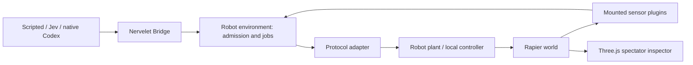

# Robot World

A standalone Nervelet experiment host: one robot in a continuous 3D world, real Bridge admission/recovery/delivery semantics, replaceable sensors and decision policies, and a Three.js inspector. No model or credentials are needed for the default experience.

## Run

Use Node 24+. From the repository root:

```sh
npm ci
npm run build
npm --prefix testbeds/robot-world ci
npm --prefix testbeds/robot-world run dev
```

Open [the local lab](http://127.0.0.1:8860). Click **Run route**. Switch between drone and rover, add sensor delay/dropout/noise, pause physics, step one tick, inspect depth readings, or export the bounded trace. **Hold** cancels pending decisions and movement; **Pause world** deliberately freezes simulation time. Browser closure does not stop the server. Ctrl+C in its terminal closes the world.

The default server binds only to loopback. `PORT` changes the port. Vite serves the development viewer; `npm run build` verifies its static client bundle, not a standalone simulation server deployment.

## Check and experiment

```sh
npm --prefix testbeds/robot-world test
npm --prefix testbeds/robot-world run typecheck
npm --prefix testbeds/robot-world run build
npm --prefix testbeds/robot-world run experiment
```

The experiment matrix runs drone/rover × three seeds × 0/500/5000 ms **simulated** thinking delay. It writes ignored evidence to `.runtime/experiments/latest.json` under this testbed. These are integration baselines, not model benchmarks. The default route is known and unobstructed; the same seed/action history reproduces on the pinned local engine. Different seeds have no physical effect until noise/dropout/random scenario generation is enabled. No cross-version/platform bitwise claim is made.

See [research findings](docs/research.md), [experiment designs](docs/experiments.md), and [recorded validation](docs/validation.md).

## Data cockpit

The lower half of the viewer contains four independent instruments:

- **Controller / agent:** decision inputs, choices, admission results and errors. Native sessions also show exposed reasoning summaries, agent messages, tool request/result pairs, command output and usage events.
- **Raw communications:** actual transmitted/received MAVLink frame hex, sizes and decoded fields, or generic records from another protocol adapter. TX and RX filters separate commands from telemetry. The direct rover adapter shows its own payloads without inventing wire bytes.
- **Robot observations:** received sensor values, sequence numbers, validity and acquisition/receipt timestamps. Filters follow the mounted sensor IDs.
- **Nervelet / execution:** bridge events, command receipts, job transitions and captured observation bundles. “Latest delivered observation” keeps a specific tool/turn delivery separate from the continuously changing samples.

Search across streams, click a row to pin its payload, select **Following** to return to live data, or expand an instrument. **Freeze inspector** stops refreshing the dashboard while physics and acquisition continue. Resume catches up with retained records. Reset starts a new diagnostic run and clears the viewer's old records. Export downloads the server's retained diagnostic data, including explicit eviction/truncation information; it is not a complete session recording.

The independent diagnostic store retains up to 240 events per channel, with 8 KiB payload copies; each browser retains 200 per channel. The latest observation copy allows 64 KiB. Payload truncation and record evictions are visible. Acquisition uses simulation time; `W` is elapsed monotonic wall time since that diagnostic run began. Reading or exporting diagnostics never calls `Bridge.step` and never acknowledges reliable domain events. Known credential fields/bearer tokens are redacted. Native configuration credentials and raw/encrypted reasoning are not collected; reasoning summaries appear only when emitted by the native session. The [documented Codex event surface](https://learn.chatgpt.com/docs/app-server#events) defines the native projection.

Protocol plugins can implement `setRecorder` to supply `{ direction, message, simMs, decoded, hex?, bytes?, frame? }`. They share the same cockpit without requiring MAVLink. The core library and controller observation contract do not gain diagnostic fields.

## Architecture and extension seams



| Module | Responsibility | How to extend |
| --- | --- | --- |
| [contracts](src/contracts.ts) | Robot, sensor, protocol and policy interfaces | Keep commands in the model's canonical JSON Schema profile |
| [world](src/world.ts) | Fixed-step physics, seeded sampling, collision events | Supply a `Scenario` and copied registries |
| [robots](src/robots.ts) | Drone and rover position servos | Implement `RobotModel.create`, `tick`, `apply`, `reached`, `hold`, `state` |
| [arm example](examples/arm.ts) | Two moving links and two joint encoders | Example of `joint_target` with no navigation command |
| [protocols](src/protocols.ts) | Direct control or binary MAVLink | Register another `ProtocolAdapter` factory |
| [sensors](src/sensors.ts) | Odometry, range ring, depth grid | Register a `SensorPlugin`; mount, frequency, age, delay and dropout stay independent |
| [environment](src/environment.ts) | Nervelet-facing evidence and bounded jobs | Own effects and cancellation here, including new actuator types |
| [runtime](src/runtime.ts) | Clock pacing, one decision in flight, bounded requests, trace | Use headless `advance(ticks)` or `startRealtime()` |
| [policies](controllers/policies.ts) | Scripted and Jev choices | Implement `DecisionPolicy`, receiving only the observation projection and candidates |
| [native runner](controllers/run-codex.ts) | Optional native session | Uses the existing Nervelet Codex driver and Supervisor |

Example customization without editing the world:

```ts
import { LabRuntime } from './src/runtime.ts';
import { defaultRegistries } from './src/world.ts';
import { droneScenario } from './src/scenarios.ts';

const registry = defaultRegistries();
registry.sensors.set('battery-fixture', {
  id: 'battery-fixture',
  sample: context => ({ remaining: Math.max(0, 1 - context.simMs / 600_000) })
});
const scenario = droneScenario();
scenario.robot.sensors.push({ id: 'battery', kind: 'battery-fixture', hz: 1 });
const lab = await LabRuntime.create(scenario, registry);
try {
  await lab.command({ kind: 'goto', args: { x: -3, y: -3, z: 3 } });
  lab.advance(300);
  console.log(await lab.observe());
} finally {
  await lab.close();
}
```

Coordinates are right-handed ENU: X east, Y north, Z up, metres and seconds. MAVLink converts explicitly to NED. Sensor acquisition uses simulation milliseconds; Bridge receipt/delivery uses monotonic wall milliseconds. Neither clock is substituted for the other. A sensor mount has body-relative translation and yaw/pitch angles in radians. Current range/depth sensors exclude the base collider and measure first ray hits; depth returns a low-resolution distance grid, not RGB or model vision.

`RobotWorld.inspect()` exposes ground truth **only for the renderer/evaluator**. Policies receive their goal, own status, mounted sensor samples, jobs and events. Sensor plugins are trusted simulation code; they must explicitly declare any privileged synthetic perception. The default odometry is simulated measured pose with optional noise, not a visual localization estimator.

Limits: eight mounted sensors, 128 initial obstacles, 64 job records, 16 queued ordinary operator requests, one in-flight policy request, and 2,000 retained trace entries. Trace eviction increments `traceDropped`. Reliable domain events use Nervelet's bounded peek/ack store, not that diagnostic ring. Each sensor delivery queue is bounded; replaceable samples coalesce. Controllers never receive the spectator state.

## MAVLink and other robotics stacks

The drone uses `node-mavlink` for actual MAVLink v2 binary encoding, framing, CRC verification and decoding. Ground-side identity is system 255/component 190; simulated vehicle identity is 1/1. Supported messages are position-only `SET_POSITION_TARGET_LOCAL_NED`, `LOCAL_POSITION_NED`, and `HEARTBEAT`. The position setpoint is accepted by a local simplified autopilot; it is **not** a command-ACK message or proof of arrival. Nervelet jobs separately report completion.

The transport is currently **in-process binary loopback**, not UDP, PX4 SITL, ArduPilot SITL, ROS or physical hardware. This makes default tests repeatable and network-free. A future MAVSDK/PX4 adapter should own setpoint streaming, arming, offboard-loss behavior and device reconciliation. A ROS 2/rosbridge adapter should translate model commands into the appropriate topics/actions and preserve the same single actuator owner. None of those integrations is claimed as implemented.

Rapier is currently the physics backend. Drone dynamics are an acceleration-limited position servo with gravity compensation and locked attitude; rover dynamics are a planar force servo with idealized low-friction contact. The reference arm is kinematic and rate-limited. They test timing, observation and job contracts, not rotor aerodynamics, tire dynamics, grasping or torque control. Robot plugins can use Rapier joints and forces; swapping the entire physics engine would need a separate backend boundary.

## Optional model controllers

The viewer defaults to scripted decisions. Live Jev must be explicitly enabled when starting the server with `LAB_ENABLE_JEV=1`, `TYPESAFE_API_KEY`, and an exact `JEV_MODEL` ID. Then select Jev in the viewer. Keys stay server-side. The adapter allows 30 calls per server lifetime, validates the returned model and chosen candidate, bounds response size/deadline, and does not retry or silently substitute another model. API tests use a fake transport. Live API behavior has not been qualified here.

For the requested native controller, set `NERVELET_CODEX_EXECUTABLE` to the actual Codex executable and run:

```sh
npm --prefix testbeds/robot-world run codex
```

This launches a separate world with its own dashboard at **http://127.0.0.1:8861** (`PORT` overrides it) and an opt-in native session, fixed to **`gpt-5.6-luna` / `xhigh`**. The dashboard displays that same native-controlled world and its agent/tool stream. It checks `model/list`, refuses fallback, uses an isolated ignored `.runtime/codex` workspace, a read-only sandbox, and bounded turns/time. It does not attach to the default server's existing world. While the native runner owns the world, route/reset/controller switching are disabled; **Stop agent** stops its supervisor. The dashboard remains available after the run ends until Ctrl+C. Native event projection and configuration have fixture coverage, not a completed live inference trial. Native tool permissions still apply.

The testbed is private and separately installed. Three.js, Rapier, Vite and MAVLink do not become Nervelet core runtime dependencies.
